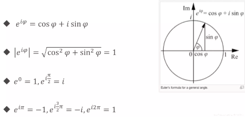
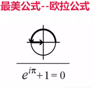

## 一、变量定义
### 1. 使用 var 关键字
- `var a, b, c bool`
- `var s1, s2 string= "hello", "world"`
- 可放在函数内，或直接放在包内
- 使用var()集中定义变量
### 2. 让编译器自动决定
- `var a, b, c = 123, "test", true`
### 3. 使用 := 定义变量
- `a, b, i, s1, s2 := true, false, 2, "hello", "world"`
- 注意: 只能在函数内使用


```go
package main

import (
	"fmt"
)

//函数外面定义变量时,必须使用var关键字,不能使用:=
//这些变量作用域,是包内变量,不存在全局变量说法
var (
	aa = "test"
	bb = true
	cc = 123
)

func variableZeroValue() {
	var a int
	var b string
	fmt.Printf("%d, %q\n", a, b)
}

//定义变量类型,不能写在一行
func variableInitValue() {
	var a, b int = 2, 3
	var c, d string = "hello", "world"
	fmt.Println(a, b, c, d)
}

//省略变量类型,可以写在一行
func varTypeDefvalue() {
	var a, b, c, d = 1, 3, true, "world"
	fmt.Println(a, b, c, d)
}

//省略var,使用 := 来定义
func variableValueShort() {
	a, b, c, d := 1, 3, true, "world"
	b = 5
	fmt.Println(a, b, c, d)
}

func main() {
	variableZeroValue()
	variableInitValue()
	varTypeDefvalue()
	variableValueShort()
	fmt.Println(aa, bb, cc)
}

```

执行输出结果：
```
0, ""
2 3 hello world
1 3 true world
1 5 true world
test true 123
```

## 二、内建变量类型
-  bool string
- (u)int (u)int8 (u)int16,   (u)int32,(u)int64, uintptr 指针  加u无符号证书,不加u有符号整数,根据操作系统分,规定长度,不规定长度
- byte rune 字符型,go语言的char类型,byte 8位,rune 32位
- float32,float64,complex64,complex128 复数类型,complex64 的实部和虚部都是float32,complex128 实部和虚部都是float64

### 1. 复数测试（欧拉公式）


     



```go
package main

import (
	"fmt"
	"math"
	"math/cmplx"
)

func euler() {
	c := 3 + 4i
	fmt.Println(cmplx.Abs(c))
	fmt.Println(cmplx.Pow(math.E, 1i * math.Pi) + 1)
	fmt.Println(cmplx.Exp(1i * math.Pi) + 1)
	fmt.Printf("%.3f\n", cmplx.Exp(1i * math.Pi) + 1)
}

func main() {
	euler()
}
```

输出结果：
```
5
(0+1.2246467991473515e-16i)
(0+1.2246467991473515e-16i)
(0.000+0.000i)
```
### 2. 类型转换是强制的,没有隐士类型转换

```go
package main

import (
	"fmt"
	"math"
	"math/cmplx"
)

// 类型转换
func triangle() {
	a, b := 3, 4
	var c int
	c = int(math.Sqrt(float64(a*a + b*b)))
	fmt.Println(c)
}

func main() {
	triangle()
}
```

输出：
```
5
```

#### 变量定义要点回顾
- 变量类型写在变量名之后
- 编译器可推测变量类型
- 没有 char，只有 rune
- 原生支持复数类型

## 三、常量定义

### 1. 常量的定义
- const filename = “abc.txt”
- const 数值可作为各种类型使用
- const a,b = 3,4
- var c = int(math.Sqrt(a*a + b*b)) // a,b 未指定类型无需转换为 float

```go
package main

import (
	"fmt"
	"math"
	"math/cmplx"
)

// 常量定义
func consts() {
	const filename = "abc.txt"
	const (
		a, b = 3, 4
		name = "lao wang"
	)
	c := math.Sqrt(a*a + b*b)
	fmt.Println(filename, c, name)
}

func main() {
	consts()
}
```
输出：
```
abc.txt 5 lao wang
```

### 2. 使用常量定义枚举类型
- 普通枚举类型
- 自增值枚举类型
```go
package main

import (
	"fmt"
	"math"
	"math/cmplx"
)

func enums() {
	//普通枚举类型
	/*const(
		cpp = 0
		java = 1
		python = 2
		golang = 3
		javascript = 4
	)*/
	//自增值枚举类型
	const(
		cpp = iota
		java
		python
		golang
		javascript
	)
	fmt.Println(cpp, java, python, golang, javascript)

	// b, kb, mb, gb, tb, pb
	const(
		b = 1 << (10 * iota)
		kb
		mb
		gb
		tb
		pb
	)
	fmt.Println(b, kb, mb, gb, tb, pb)
}

func main() {
	enums()
}
```
输出：
```
0 1 2 3 4
1 1024 1048576 1073741824 1099511627776 1125899906842624
```

## 四、条件语句
### 1. if 语句
- if 的条件里不需要括号
- if 的条件里可以赋值
- if 的条件里赋值的变量作用域就在这个 if 语句里

```go
package main

import (
	"fmt"
	"io/ioutil"
)

func readFile1() {
	const filename = "learnGo/chapter_02/02_branch/abc.txt" // abc.txt = aaaa\nbbbbb\ncccc
	contents, err := ioutil.ReadFile(filename)
	if err != nil {
		fmt.Println(err)
	}else{
		fmt.Printf("%s\n", contents)
	}
}

func readFile2() {
	const filename = "learnGo/chapter_02/02_branch/abc.txt" // abc.txt = aaaa\nbbbbb\ncccc
	if contents, err := ioutil.ReadFile(filename); err != nil {
		fmt.Println(err)
	}else {
		fmt.Printf("%s\n", contents)
	}
	//fmt.Println("%s\n", contents)   # contents 是if中定义的变量，出了if后，变量的生命周期结束了
}

func main() {
	readFile1()
	fmt.Println()
	readFile2()
}
```
输出结果：
```
aaaa
bbbbb
cccc

aaaa
bbbbb
cccc
```

### 2. switch 语句
- switch 会自动 break，除非使用fallthrough
- switch 后可以没有表达式

```go
package main

import "fmt"

// switch 语句
func grade(score int) string {
	g := ""
	switch {
	case score < 0 || score > 100:
		panic(fmt.Sprintf("Wrong score: %d", score))
	case score < 60:
		g = "F"
	case score < 70:
		g = "D"
	case score < 80:
		g = "C"
	case score < 90:
		g = "B"
	case score <= 100:
		g = "A"
	}
	return g
}

func main() {
	fmt.Println(grade(30))
    fmt.Println(grade(60))
    fmt.Println(grade(70))
    fmt.Println(grade(80))
    fmt.Println(grade(90))
    fmt.Println(grade(100))
    //fmt.Println(grade(-1))
    //fmt.Println(grade(101))
}
```
输出结果：
```
F
D
C
B
A
A
```

## 五、循环语句
### 1. for 语句
- for的条件里不需要括号
- for的条件里可以省略初始条件,结束条件,递增表达式
- for省略初始条件,相当于while
- for省略初始条件和递增条件,相当于while
- for 初始条件,结束条件,递增表达式都不加就是死循环
```go
package main

import (
	"bufio"
	"fmt"
	"os"
	"strconv"
	"time"
)

// for 省略初始条件,相当于while
func convertTOBin(n int) string {
	inputN := n
	res := ""
	for ; n >0; n /= 2 {
		lsb := n % 2
		res = strconv.Itoa(lsb) + res
	}
	fmt.Printf("Int: %10d, Bin: %s\n", inputN, res)
	return res
}

// for 省略初始条件和递增条件
func printFile(filename string) {
	file, err := os.Open(filename)
	if err != nil {
		panic(err)
	}
	scanner := bufio.NewScanner(file)
	for ; scanner.Scan(); {
		fmt.Println(scanner.Text())
	}
}

//3.初始条件,结束条件,递增表达式都不加就是死循环
func forever() string {
	for {
		fmt.Println("Forever loop")
		time.Sleep(1 * time.Second)
	}
}

func main() {
	convertTOBin(5)
	convertTOBin(9)
	convertTOBin(13)
	convertTOBin(32)
	convertTOBin(34534)
	fmt.Println()
	const filename = "learnGo/chapter_02/02_branch/abc.txt" // abc.txt = aaaa\nbbbbb\ncccc
	printFile(filename)
	fmt.Println()
	forever()
}

```
输出结果：
```
Int:          5, Bin: 101
Int:          9, Bin: 1001
Int:         13, Bin: 1101
Int:         32, Bin: 100000
Int:      34534, Bin: 1000011011100110

aaaa
bbbbb
cccc

Forever loop
Forever loop
Forever loop

```

## 六、函数

- 函数定义 `func eval(a, b int, op string) int {}`
- 返回值类型写在最后面
- 可返回多个值
- 函数可作为参数
- 没有默认参数、可选参数
```go
package main

import (
	"fmt"
	"math"
	"reflect"
	"runtime"
)

// 函数定义，可以返回多个值
func eval(a, b int, op string) (int, error) {
	res := 0
	switch op {
	case "+":
		res = a + b
	case "-":
		res = a - b
	case "*":
		res = a * b
	case "/":
		//res = a / b
		res, _ = div(a, b)
	default:
		//return res, fmt.Errorf("unsupport operation: %s", op)
	}
	return res, nil
}

// 7 / 4 = 1 ... 3
// 输出起名字
func div(a, b int) (q, r int) {
	//q = a / b
	//r = a % b
	//fmt.Printf("%d / %d = %d ... %d\n", a, b, q, r)
	//return
	return a / b, a % b
}

// 函数的参数可以是函数
func apply(op func(int, int) int, a, b int) int {
	p := reflect.ValueOf(op).Pointer()
	opName := runtime.FuncForPC(p).Name()
	fmt.Printf("Calling function: %s with args: (%d, %d)\n", opName, a, b)
	return op(a, b)
}

// 定义pow函数
func pow(a, b int) int {
	return int(math.Pow(float64(a), float64(b)))
}

// 可变参数列表
func sum(numbers ...int) int {
	sum := 0
	for i:=range numbers {
		sum += numbers[i]
	}
	return sum
}

func main() {
	if res, err := eval(4, 3, "-"); err != nil {
		fmt.Printf("Error: %s\n", err)
		panic(err)
	} else {
		fmt.Println(res)
	}

	q, r := div(10, 3)
	fmt.Printf("10 / 3 = %d ... %d\n", q, r)

	fmt.Println(apply(pow, 3, 4))

	fmt.Println(apply(
		func(a int, b int) int {
			return int(math.Pow(float64(a), float64(b)))
		}, 3, 4))

	fmt.Println(sum(1, 2, 3, 4, 5))
}
```
输出结果：
```
1
10 / 3 = 3 ... 1
Calling function: main.pow with args: (3, 4)
81
Calling function: main.main.func1 with args: (3, 4)
81
15

```
## 七、指针
- Go语言指针不能运算
- Go 语言只有值传递一种方式
### 1. 参数传递

### 2. 拷贝一份a的地址，使用指针传递相当于引用传递的效果

### 3. Go语言中Object类型的名字叫Cache


```go
package main

import "fmt"

// 通过指针来交换值
func swap1(a, b *int) {
	*a, *b = *b, *a
}

func swap2(a, b int) (int, int) {
	return b, a
}

func main() {
	a, b := 3, 4
	swap1(&a, &b)
	fmt.Println(a, b)
	a, b = 3, 4
	a, b = swap2(a, b)
	fmt.Println(a, b)
}
```
输出结果：
```
4 3
4 3
```

