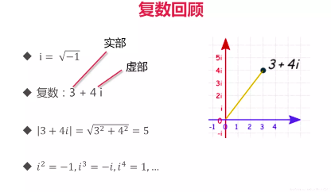
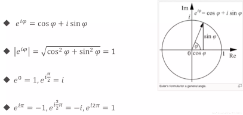
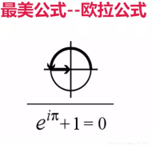

## 一、变量定义
### 1. 使用 var 关键字
- `var a, b, c bool`
- `var s1, s2 string= "hello", "world"`
- 可放在函数内，或直接放在包内
- 使用var()集中定义变量
### 2. 让编译器自动决定
- `var a, b, c = 123, "test", true`
### 3. 使用 := 定义变量
- `a, b, i, s1, s2 := true, false, 2, "hello", "world"`
- 注意: 只能在函数内使用


```go
package main

import (
	"fmt"
)

//函数外面定义变量时,必须使用var关键字,不能使用:=
//这些变量作用域,是包内变量,不存在全局变量说法
var (
	aa = "test"
	bb = true
	cc = 123
)

func variableZeroValue() {
	var a int
	var b string
	fmt.Printf("%d, %q\n", a, b)
}

//定义变量类型,不能写在一行
func variableInitValue() {
	var a, b int = 2, 3
	var c, d string = "hello", "world"
	fmt.Println(a, b, c, d)
}

//省略变量类型,可以写在一行
func varTypeDefvalue() {
	var a, b, c, d = 1, 3, true, "world"
	fmt.Println(a, b, c, d)
}

//省略var,使用 := 来定义
func variableValueShort() {
	a, b, c, d := 1, 3, true, "world"
	b = 5
	fmt.Println(a, b, c, d)
}

func main() {
	variableZeroValue()
	variableInitValue()
	varTypeDefvalue()
	variableValueShort()
	fmt.Println(aa, bb, cc)
}

```

执行输出结果：
```
0, ""
2 3 hello world
1 3 true world
1 5 true world
test true 123
```

## 二、内建变量类型
-  bool string
- (u)int (u)int8 (u)int16,   (u)int32,(u)int64, uintptr 指针  加u无符号证书,不加u有符号整数,根据操作系统分,规定长度,不规定长度
- byte rune 字符型,go语言的char类型,byte 8位,rune 32位
- float32,float64,complex64,complex128 复数类型,complex64 的实部和虚部都是float32,complex128 实部和虚部都是float64

### 1. 复数测试（欧拉公式）


     



```go
package main

import (
	"fmt"
	"math"
	"math/cmplx"
)

func euler() {
	c := 3 + 4i
	fmt.Println(cmplx.Abs(c))
	fmt.Println(cmplx.Pow(math.E, 1i * math.Pi) + 1)
	fmt.Println(cmplx.Exp(1i * math.Pi) + 1)
	fmt.Printf("%.3f\n", cmplx.Exp(1i * math.Pi) + 1)
}

func main() {
	euler()
}
```

输出结果：
```
5
(0+1.2246467991473515e-16i)
(0+1.2246467991473515e-16i)
(0.000+0.000i)
```
### 2. 类型转换是强制的,没有隐士类型转换

```go
package main

import (
	"fmt"
	"math"
	"math/cmplx"
)

// 类型转换
func triangle() {
	a, b := 3, 4
	var c int
	c = int(math.Sqrt(float64(a*a + b*b)))
	fmt.Println(c)
}

func main() {
	triangle()
}
```

输出：
```
5
```

#### 变量定义要点回顾
- 变量类型写在变量名之后
- 编译器可推测变量类型
- 没有 char，只有 rune
- 原生支持复数类型

## 三、常量定义

### 1. 常量的定义
- const filename = “abc.txt”
- const 数值可作为各种类型使用
- const a,b = 3,4
- var c = int(math.Sqrt(a*a + b*b)) // a,b 未指定类型无需转换为 float

```go
package main

import (
	"fmt"
	"math"
	"math/cmplx"
)

// 常量定义
func consts() {
	const filename = "abc.txt"
	const (
		a, b = 3, 4
		name = "lao wang"
	)
	c := math.Sqrt(a*a + b*b)
	fmt.Println(filename, c, name)
}

func main() {
	consts()
}
```
输出：
```
abc.txt 5 lao wang
```

### 2. 使用常量定义枚举类型
- 普通枚举类型
- 自增值枚举类型
```go
package main

import (
	"fmt"
	"math"
	"math/cmplx"
)

func enums() {
	//普通枚举类型
	/*const(
		cpp = 0
		java = 1
		python = 2
		golang = 3
		javascript = 4
	)*/
	//自增值枚举类型
	const(
		cpp = iota
		java
		python
		golang
		javascript
	)
	fmt.Println(cpp, java, python, golang, javascript)

	// b, kb, mb, gb, tb, pb
	const(
		b = 1 << (10 * iota)
		kb
		mb
		gb
		tb
		pb
	)
	fmt.Println(b, kb, mb, gb, tb, pb)
}

func main() {
	enums()
}
```
输出：
```
0 1 2 3 4
1 1024 1048576 1073741824 1099511627776 1125899906842624
```
