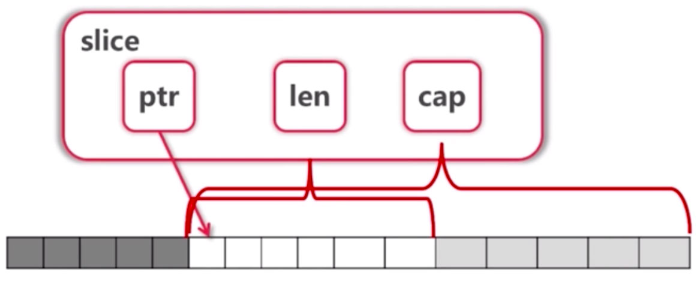
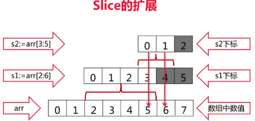

# 内建容器
## 一、数组
- 数组定义
    ```
    var arr1 [5]int // 声明数组
    arr2 := [3]int{1, 3, 5}  // 声明数组并赋值
    arr3 := [...]int{2, 4, 6, 8, 10} // 不输入数组长度，让编译器来计算长度
    var grid [4][5]int // 二维数组
    ```
 
 - 数量写在类型前
 - 可通过 _ 来省略变量，不仅仅是 range，任何地方都可通过 _ 来省略变量
    ```
    sum := 0
    for _, v := range numbers {
        sum += v
    }
    ```
 - 如果只要下标 i，可写成for i := range numbers
 - 数组是值类型
    - [10]int 和[20]int 是不同类型
    - 调用 func f(arr [10]int)会 拷贝 数组
    -  在 go 语言中一般不直接使用数组（指针），使用切片
 
```go
package main

import "fmt"

func printArray(arr [5]int) {
	fmt.Println("Traversal i")
	for i := range arr {
		fmt.Println(arr[i])
	}
	fmt.Println("Traversal (i, val)")
	for i, v := range arr {
		fmt.Println(i, v)
	}
	fmt.Println("Traversal (_, val)")
	for _, v := range arr {
		fmt.Println(v)
	}
}

// 值类型传递 函数中修改入参数组，函数外不会被修改
func modifyArray1(arr [5]int) {
	arr[0] = 100
	fmt.Println(arr)
}

// 值类型传递 函数中修改入参数组，函数外不会被修改
func modifyArray2(arr *[5]int) {
	(*arr)[0] = 100
	arr[1] = 101
	fmt.Println(*arr)
}

func main() {
	fmt.Printf("-------------Define arr test-----------\n")
	var arr1 [5]int
	var arr2 = [5]int{2, 4, 6, 7, 8}
	arr3 := [3]int{1, 3, 5}
	arr4 := [...]int{2, 4, 6, 7, 8}
	var arr5 [3][5]int

	fmt.Println(arr1)
	fmt.Println(arr2)
	fmt.Println(arr3)
	fmt.Println(arr4)
	fmt.Println(arr5)

	fmt.Printf("-------------Print arr2 test: %d-------------\n", arr4)
	printArray(arr2)

	fmt.Printf("-------------Modify arr4 test: %d-------------\n", arr4)
	modifyArray1(arr4)
	fmt.Println(arr4)
	modifyArray2(&arr4)
	fmt.Println(arr4)
}
```
输出结果：
```
-------------Define arr test-----------
[0 0 0 0 0]
[2 4 6 7 8]
[1 3 5]
[2 4 6 7 8]
[[0 0 0 0 0] [0 0 0 0 0] [0 0 0 0 0]]
-------------Print arr2 test: [2 4 6 7 8]-------------
Traversal i
2
4
6
7
8
Traversal (i, val)
0 2
1 4
2 6
3 7
4 8
Traversal (_, val)
2
4
6
7
8
-------------Modify arr4 test: [2 4 6 7 8]-------------
[100 4 6 7 8]
[2 4 6 7 8]
[100 101 6 7 8]
[100 101 6 7 8]

```
## 二、切片 Slice
- Slice本身没有数据，是对底层 array 的一个 view

    
- 切片的定义方法
    ```go
    // 方法一： 通过对数组的切片获取
    arr := [...]int{0, 1, 2, 3, 4, 5, 6, 7}
    s := arr[2:6]
    // 方法二： 直接定义切片，底层会自动为其分配数组
    var s1 []int
    var s2 = []int{1, 2, 3}
    s3 := []int{1, 2, 3}
    // 方法三：通过make 定义 Slice
    s4 := make([]int, 8)   // len=8, cap=8
    s5 := make([]int, 10, 16) // len=10, cap=16
    ```
- Slice 可以的扩展
    ```go
    arr := [...]int{0,1,2,3,4,5,6,7}
    s1 := arr[2:6]
    s2 := s1[3:5]
    
    // s1的值为？
    // s2的值为？
    ```
    
    - s1的值为[2 3 4 5], s2的值为[5 6]
    - slice可以向后扩展，不可以向前扩展
    - s[i]不可以超越len(s),向后扩展不可以超越底层数组cap(s)
- 向Slice添加元素
    ```go
    arr := [...]int{0,1,2,3,4,5,6,7}
    s1 := arr[2:6]
    s2 := s1[3:5]
    s3 := append(s2, 10)
    s4 := append(s3, 11)
    s5 := append(s4, 12)
    // s3, s4, s5的值为？arr的值为？
    fmt.Println("s3, s4, s5 =", s3, s4, s5)  // s3, s4, s5 = [5 6 10] [5 6 10 11] [5 6 10 11 12]
    fmt.Println("arr =", arr)  // arr = [0 1 2 3 4 5 6 10] 
    // s4 and s5 不再 view arr，而是新的array
    ```
    - 添加元素时如果超越cap，系统会重新分配更大的底层数组
    - 由于值传递的关系，必须接收append的返回值 `s = append(s, val)`

- Slice 的完整测试代码
```go
package main

import "fmt"

func printSlice(sliceName string, s []int) {
	fmt.Printf("Slice %s=%v, len=%d, cap=%d\n", sliceName, s, len(s), cap(s))
}

func appendSlice() {
	var s []int
	for i := 0; i < 10; i++ {
		printSlice("s", s)
		s = append(s, i*2)
		s = append(s, i*2+1)
	}
}

func main() {
	arr := [8]int{0, 1, 2, 3, 4, 5, 6, 7}
	// Slice本身没有数据，是对底层 array 的一个 view
	fmt.Println("------------定义切片----------")
	fmt.Println("arr[2:6] = ", arr[2:6])
	fmt.Println("arr[:6] = ", arr[:6])
	fmt.Println("arr[2:] = ", arr[2:])
	fmt.Println("arr[:] = ", arr[:])

	// 切片的切片 Re_slice(Slice the Slice)
	fmt.Println("------------切片的切片----------")
	printSlice("arr", arr[:])
	s1 := arr[2:6]
	printSlice("s1", s1)
	s2 := s1[3:5]
	printSlice("s2", s2)

	// 切片超出 cap, 将会报错：panic: runtime error: slice bounds out of range [:7] with capacity 6
	fmt.Println("------------切片超出 cap----------")
	printSlice("arr", arr[:])
	s1 = arr[2:6]
	printSlice("s1", s1)
	//s2 = s1[3:7]
	//printSlice("s2", s2)

	// 切片添加元素 append
	fmt.Println("------------切片添加元素 append----------")
	printSlice("arr", arr[:])
	s1 = arr[2:7]
	printSlice("s1", s1)
	s1 = append(s1, 10)
	printSlice("s1", s1)
	printSlice("arr", arr[:])
	// 超出 arr 的 cap, 系统将会定义一个新的arr来对应 s1, 旧的arr在系统没有使用的情况下会被垃圾回收
	s1 = append(s1, 11)
	printSlice("s1", s1)
	printSlice("arr", arr[:])

	// 使用 make 定义切片 （可以指定切片的 len 和 cap）
	fmt.Println("------------使用 make 定义切片----------")
	makeS1 := make([]int, 10, 32) // Slice make_s1=[0 0 0 0 0 0 0 0 0 0], len=10, cap=32
	printSlice("make_s1", makeS1)

	// 拷贝slice到另一个slice
	fmt.Println("------------拷贝slice到另一个slice----------")
	arr = [8]int{0, 1, 2, 3, 4, 5, 6, 7}
	s1 = arr[2:7]
	s2 = make([]int, 10, 16)
	printSlice("s1", s1)
	printSlice("s2", s2)
	num := copy(s2, s1) // func copy(dst, src []Type) int
	fmt.Println("拷贝 s1 到另一个 s2, 总计 copy 个数: ", num)
	printSlice("s1", s1)
	printSlice("s2", s2)

	// 删除 slice 中的元素, 没有内建方法，需要通过 copy 覆盖掉要删除的元素
	fmt.Println("------------ 删除 slice 中 第3个元素 ----------")
	srcS1 := []int{0, 1, 2, 3, 4, 5, 6, 7}
	printSlice("srcS1", srcS1)
	srcS1 = append(srcS1[:3], srcS1[4:]...)
	printSlice("srcS1", srcS1)

	// Pop slice 中的第一元素, Pop slice 中的最后一元素
	fmt.Println("------------ Pop slice 中的第一元素, Pop slice 中的最后一元素 ----------")
	fmt.Println("Pop slice 中的第一元素")
	srcS1 = []int{0, 1, 2, 3, 4, 5, 6, 7}
	printSlice("srcS1", srcS1)
	fmt.Println("Pop slice first element: ", srcS1[0])
	srcS1 = srcS1[1:]
	printSlice("srcS1", srcS1)

	fmt.Println("Pop slice last element: ", srcS1[len(srcS1)-1])
	srcS1 = srcS1[:len(srcS1)-1]
	printSlice("srcS1", srcS1)

	// 测试 slice 的自动扩容
	fmt.Println("------------ 测试 slice 的自动扩容 ----------")
	appendSlice()
}
```
输出结果：
```
------------定义切片----------
arr[2:6] =  [2 3 4 5]
arr[:6] =  [0 1 2 3 4 5]
arr[2:] =  [2 3 4 5 6 7]
arr[:] =  [0 1 2 3 4 5 6 7]
------------切片的切片----------
Slice arr=[0 1 2 3 4 5 6 7], len=8, cap=8
Slice s1=[2 3 4 5], len=4, cap=6
Slice s2=[5 6], len=2, cap=3
------------切片超出 cap----------
Slice arr=[0 1 2 3 4 5 6 7], len=8, cap=8
Slice s1=[2 3 4 5], len=4, cap=6
------------切片添加元素 append----------
Slice arr=[0 1 2 3 4 5 6 7], len=8, cap=8
Slice s1=[2 3 4 5 6], len=5, cap=6
Slice s1=[2 3 4 5 6 10], len=6, cap=6
Slice arr=[0 1 2 3 4 5 6 10], len=8, cap=8
Slice s1=[2 3 4 5 6 10 11], len=7, cap=12
Slice arr=[0 1 2 3 4 5 6 10], len=8, cap=8
------------使用 make 定义切片----------
Slice make_s1=[0 0 0 0 0 0 0 0 0 0], len=10, cap=32
------------拷贝slice到另一个slice----------
Slice s1=[2 3 4 5 6], len=5, cap=6
Slice s2=[0 0 0 0 0 0 0 0 0 0], len=10, cap=16
拷贝 s1 到另一个 s2, 总计 copy 个数:  5
Slice s1=[2 3 4 5 6], len=5, cap=6
Slice s2=[2 3 4 5 6 0 0 0 0 0], len=10, cap=16
------------ 删除 slice 中 第3个元素 ----------
Slice srcS1=[0 1 2 3 4 5 6 7], len=8, cap=8
Slice srcS1=[0 1 2 4 5 6 7], len=7, cap=8
------------ Pop slice 中的第一元素, Pop slice 中的最后一元素 ----------
Pop slice 中的第一元素
Slice srcS1=[0 1 2 3 4 5 6 7], len=8, cap=8
Pop slice first element:  0
Slice srcS1=[1 2 3 4 5 6 7], len=7, cap=7
Pop slice last element:  7
Slice srcS1=[1 2 3 4 5 6], len=6, cap=7
------------ 测试 slice 的自动扩容 ----------
Slice s=[], len=0, cap=0
Slice s=[0 1], len=2, cap=2
Slice s=[0 1 2 3], len=4, cap=4
Slice s=[0 1 2 3 4 5], len=6, cap=8
Slice s=[0 1 2 3 4 5 6 7], len=8, cap=8
Slice s=[0 1 2 3 4 5 6 7 8 9], len=10, cap=16
Slice s=[0 1 2 3 4 5 6 7 8 9 10 11], len=12, cap=16
Slice s=[0 1 2 3 4 5 6 7 8 9 10 11 12 13], len=14, cap=16
Slice s=[0 1 2 3 4 5 6 7 8 9 10 11 12 13 14 15], len=16, cap=16
Slice s=[0 1 2 3 4 5 6 7 8 9 10 11 12 13 14 15 16 17], len=18, cap=32

```