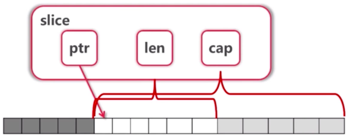
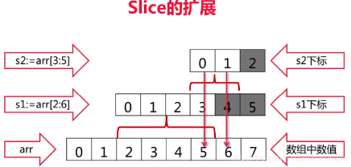

# 内建容器
## 一、数组
- 数组定义
    ```
    var arr1 [5]int // 声明数组
    arr2 := [3]int{1, 3, 5}  // 声明数组并赋值
    arr3 := [...]int{2, 4, 6, 8, 10} // 不输入数组长度，让编译器来计算长度
    var grid [4][5]int // 二维数组
    ```
 
 - 数量写在类型前
 - 可通过 _ 来省略变量，不仅仅是 range，任何地方都可通过 _ 来省略变量
    ```
    sum := 0
    for _, v := range numbers {
        sum += v
    }
    ```
 - 如果只要下标 i，可写成for i := range numbers
 - 数组是值类型
    - [10]int 和[20]int 是不同类型
    - 调用 func f(arr [10]int)会 拷贝 数组
    -  在 go 语言中一般不直接使用数组（指针），使用切片
 
```go
package main

import "fmt"

func printArray(arr [5]int) {
	fmt.Println("Traversal i")
	for i := range arr {
		fmt.Println(arr[i])
	}
	fmt.Println("Traversal (i, val)")
	for i, v := range arr {
		fmt.Println(i, v)
	}
	fmt.Println("Traversal (_, val)")
	for _, v := range arr {
		fmt.Println(v)
	}
}

// 值类型传递 函数中修改入参数组，函数外不会被修改
func modifyArray1(arr [5]int) {
	arr[0] = 100
	fmt.Println(arr)
}

// 值类型传递 函数中修改入参数组，函数外不会被修改
func modifyArray2(arr *[5]int) {
	(*arr)[0] = 100
	arr[1] = 101
	fmt.Println(*arr)
}

func main() {
	fmt.Printf("-------------Define arr test-----------\n")
	var arr1 [5]int
	var arr2 = [5]int{2, 4, 6, 7, 8}
	arr3 := [3]int{1, 3, 5}
	arr4 := [...]int{2, 4, 6, 7, 8}
	var arr5 [3][5]int

	fmt.Println(arr1)
	fmt.Println(arr2)
	fmt.Println(arr3)
	fmt.Println(arr4)
	fmt.Println(arr5)

	fmt.Printf("-------------Print arr2 test: %d-------------\n", arr4)
	printArray(arr2)

	fmt.Printf("-------------Modify arr4 test: %d-------------\n", arr4)
	modifyArray1(arr4)
	fmt.Println(arr4)
	modifyArray2(&arr4)
	fmt.Println(arr4)
}
```
输出结果：
```
-------------Define arr test-----------
[0 0 0 0 0]
[2 4 6 7 8]
[1 3 5]
[2 4 6 7 8]
[[0 0 0 0 0] [0 0 0 0 0] [0 0 0 0 0]]
-------------Print arr2 test: [2 4 6 7 8]-------------
Traversal i
2
4
6
7
8
Traversal (i, val)
0 2
1 4
2 6
3 7
4 8
Traversal (_, val)
2
4
6
7
8
-------------Modify arr4 test: [2 4 6 7 8]-------------
[100 4 6 7 8]
[2 4 6 7 8]
[100 101 6 7 8]
[100 101 6 7 8]

```
## 二、切片 Slice
- Slice本身没有数据，是对底层 array 的一个 view

    
- 切片的定义方法
    ```go
    // 方法一： 通过对数组的切片获取
    arr := [...]int{0, 1, 2, 3, 4, 5, 6, 7}
    s := arr[2:6]
    // 方法二： 直接定义切片，底层会自动为其分配数组
    var s1 []int
    var s2 = []int{1, 2, 3}
    s3 := []int{1, 2, 3}
    // 方法三：通过make 定义 Slice
    s4 := make([]int, 8)   // len=8, cap=8
    s5 := make([]int, 10, 16) // len=10, cap=16
    ```
- Slice 可以的扩展
    ```go
    arr := [...]int{0,1,2,3,4,5,6,7}
    s1 := arr[2:6]
    s2 := s1[3:5]
    
    // s1的值为？
    // s2的值为？
    ```
    
    - s1的值为[2 3 4 5], s2的值为[5 6]
    - slice可以向后扩展，不可以向前扩展
    - s[i]不可以超越len(s),向后扩展不可以超越底层数组cap(s)
- 向Slice添加元素
    ```go
    arr := [...]int{0,1,2,3,4,5,6,7}
    s1 := arr[2:6]
    s2 := s1[3:5]
    s3 := append(s2, 10)
    s4 := append(s3, 11)
    s5 := append(s4, 12)
    // s3, s4, s5的值为？arr的值为？
    fmt.Println("s3, s4, s5 =", s3, s4, s5)  // s3, s4, s5 = [5 6 10] [5 6 10 11] [5 6 10 11 12]
    fmt.Println("arr =", arr)  // arr = [0 1 2 3 4 5 6 10] 
    // s4 and s5 不再 view arr，而是新的array
    ```
    - 添加元素时如果超越cap，系统会重新分配更大的底层数组
    - 由于值传递的关系，必须接收append的返回值 `s = append(s, val)`

- Slice 的完整测试代码
```go
package main

import "fmt"

func printSlice(sliceName string, s []int) {
	fmt.Printf("Slice %s=%v, len=%d, cap=%d\n", sliceName, s, len(s), cap(s))
}

func appendSlice() {
	var s []int
	for i := 0; i < 10; i++ {
		printSlice("s", s)
		s = append(s, i*2)
		s = append(s, i*2+1)
	}
}

func main() {
	arr := [8]int{0, 1, 2, 3, 4, 5, 6, 7}
	// Slice本身没有数据，是对底层 array 的一个 view
	fmt.Println("------------定义切片----------")
	fmt.Println("arr[2:6] = ", arr[2:6])
	fmt.Println("arr[:6] = ", arr[:6])
	fmt.Println("arr[2:] = ", arr[2:])
	fmt.Println("arr[:] = ", arr[:])

	// 切片的切片 Re_slice(Slice the Slice)
	fmt.Println("------------切片的切片----------")
	printSlice("arr", arr[:])
	s1 := arr[2:6]
	printSlice("s1", s1)
	s2 := s1[3:5]
	printSlice("s2", s2)

	// 切片超出 cap, 将会报错：panic: runtime error: slice bounds out of range [:7] with capacity 6
	fmt.Println("------------切片超出 cap----------")
	printSlice("arr", arr[:])
	s1 = arr[2:6]
	printSlice("s1", s1)
	//s2 = s1[3:7]
	//printSlice("s2", s2)

	// 切片添加元素 append
	fmt.Println("------------切片添加元素 append----------")
	printSlice("arr", arr[:])
	s1 = arr[2:7]
	printSlice("s1", s1)
	s1 = append(s1, 10)
	printSlice("s1", s1)
	printSlice("arr", arr[:])
	// 超出 arr 的 cap, 系统将会定义一个新的arr来对应 s1, 旧的arr在系统没有使用的情况下会被垃圾回收
	s1 = append(s1, 11)
	printSlice("s1", s1)
	printSlice("arr", arr[:])

	// 使用 make 定义切片 （可以指定切片的 len 和 cap）
	fmt.Println("------------使用 make 定义切片----------")
	makeS1 := make([]int, 10, 32) // Slice make_s1=[0 0 0 0 0 0 0 0 0 0], len=10, cap=32
	printSlice("make_s1", makeS1)

	// 拷贝slice到另一个slice
	fmt.Println("------------拷贝slice到另一个slice----------")
	arr = [8]int{0, 1, 2, 3, 4, 5, 6, 7}
	s1 = arr[2:7]
	s2 = make([]int, 10, 16)
	printSlice("s1", s1)
	printSlice("s2", s2)
	num := copy(s2, s1) // func copy(dst, src []Type) int
	fmt.Println("拷贝 s1 到另一个 s2, 总计 copy 个数: ", num)
	printSlice("s1", s1)
	printSlice("s2", s2)

	// 删除 slice 中的元素, 没有内建方法，需要通过 copy 覆盖掉要删除的元素
	fmt.Println("------------ 删除 slice 中 第3个元素 ----------")
	srcS1 := []int{0, 1, 2, 3, 4, 5, 6, 7}
	printSlice("srcS1", srcS1)
	srcS1 = append(srcS1[:3], srcS1[4:]...)
	printSlice("srcS1", srcS1)

	// Pop slice 中的第一元素, Pop slice 中的最后一元素
	fmt.Println("------------ Pop slice 中的第一元素, Pop slice 中的最后一元素 ----------")
	fmt.Println("Pop slice 中的第一元素")
	srcS1 = []int{0, 1, 2, 3, 4, 5, 6, 7}
	printSlice("srcS1", srcS1)
	fmt.Println("Pop slice first element: ", srcS1[0])
	srcS1 = srcS1[1:]
	printSlice("srcS1", srcS1)

	fmt.Println("Pop slice last element: ", srcS1[len(srcS1)-1])
	srcS1 = srcS1[:len(srcS1)-1]
	printSlice("srcS1", srcS1)

	// 测试 slice 的自动扩容
	fmt.Println("------------ 测试 slice 的自动扩容 ----------")
	appendSlice()
}
```
输出结果：
```
------------定义切片----------
arr[2:6] =  [2 3 4 5]
arr[:6] =  [0 1 2 3 4 5]
arr[2:] =  [2 3 4 5 6 7]
arr[:] =  [0 1 2 3 4 5 6 7]
------------切片的切片----------
Slice arr=[0 1 2 3 4 5 6 7], len=8, cap=8
Slice s1=[2 3 4 5], len=4, cap=6
Slice s2=[5 6], len=2, cap=3
------------切片超出 cap----------
Slice arr=[0 1 2 3 4 5 6 7], len=8, cap=8
Slice s1=[2 3 4 5], len=4, cap=6
------------切片添加元素 append----------
Slice arr=[0 1 2 3 4 5 6 7], len=8, cap=8
Slice s1=[2 3 4 5 6], len=5, cap=6
Slice s1=[2 3 4 5 6 10], len=6, cap=6
Slice arr=[0 1 2 3 4 5 6 10], len=8, cap=8
Slice s1=[2 3 4 5 6 10 11], len=7, cap=12
Slice arr=[0 1 2 3 4 5 6 10], len=8, cap=8
------------使用 make 定义切片----------
Slice make_s1=[0 0 0 0 0 0 0 0 0 0], len=10, cap=32
------------拷贝slice到另一个slice----------
Slice s1=[2 3 4 5 6], len=5, cap=6
Slice s2=[0 0 0 0 0 0 0 0 0 0], len=10, cap=16
拷贝 s1 到另一个 s2, 总计 copy 个数:  5
Slice s1=[2 3 4 5 6], len=5, cap=6
Slice s2=[2 3 4 5 6 0 0 0 0 0], len=10, cap=16
------------ 删除 slice 中 第3个元素 ----------
Slice srcS1=[0 1 2 3 4 5 6 7], len=8, cap=8
Slice srcS1=[0 1 2 4 5 6 7], len=7, cap=8
------------ Pop slice 中的第一元素, Pop slice 中的最后一元素 ----------
Pop slice 中的第一元素
Slice srcS1=[0 1 2 3 4 5 6 7], len=8, cap=8
Pop slice first element:  0
Slice srcS1=[1 2 3 4 5 6 7], len=7, cap=7
Pop slice last element:  7
Slice srcS1=[1 2 3 4 5 6], len=6, cap=7
------------ 测试 slice 的自动扩容 ----------
Slice s=[], len=0, cap=0
Slice s=[0 1], len=2, cap=2
Slice s=[0 1 2 3], len=4, cap=4
Slice s=[0 1 2 3 4 5], len=6, cap=8
Slice s=[0 1 2 3 4 5 6 7], len=8, cap=8
Slice s=[0 1 2 3 4 5 6 7 8 9], len=10, cap=16
Slice s=[0 1 2 3 4 5 6 7 8 9 10 11], len=12, cap=16
Slice s=[0 1 2 3 4 5 6 7 8 9 10 11 12 13], len=14, cap=16
Slice s=[0 1 2 3 4 5 6 7 8 9 10 11 12 13 14 15], len=16, cap=16
Slice s=[0 1 2 3 4 5 6 7 8 9 10 11 12 13 14 15 16 17], len=18, cap=32

```
## 三、Map
### 1. Map的操作
- Map：`map[K]V, map[K1]map[K2]V（复合 map`）
- 创建：`make(map[string] int)`
- 获取元素：`m[key]`
- key 不存在时，获得Value 类型的初始值（Zero value）
- 用 value, ok := m[key] 来判断是否存在 key
- 用 delete 删除一个 key

### 2. map 的遍历
- 使用 range 遍历 key，或者遍历 key, value 对
- 不保证遍历顺序，如需顺序，需手动对 key 排序
- 使用 len 获取元素个数

### 3. map 中的 key
- map 使用哈希表，必须可以比较相等
- 除 slice, map, function 外的内建类型都可以作为 key
- Struct 类型不包含上述字段，也可作为 key

### 4. Map 的基本操作示例
```go
package main

import "fmt"

func main() {
	// map 的定义
	fmt.Println("------------ map 的定义 ----------")
	m := map[string]string{
		"course": "golang",
		"site":   "imooc",
	}
	m1 := make(map[string]int)
	var m2 map[string]int
	fmt.Println("m=", m)
	fmt.Println("m1=", m1)
	fmt.Println("m2=", m2)

	// 定义 map 中嵌套 map
	mm := map[string]map[string]string{
		"name": {
			"first":  "Wang",
			"second": "er"},
		"age": {"last_year": "18"}}
	for k, v := range mm {
		fmt.Println(k, v)
	}

	// map 的遍历
	fmt.Println("------------ map 的遍历 ----------")
	for k, v := range m {
		fmt.Println(k, v)
	}
	fmt.Println("只遍历 map 中的 key")
	for k := range m { // 只遍历 map 中的 key
		fmt.Println(k)
	}
	fmt.Println("只遍历 map 中的 val")
	for _, v := range m { // 只遍历 map 中的 val
		fmt.Println(v)
	}

	// 获取 map 中的值
	fmt.Println("------------ 修改和删除map中的值 ----------")
	fmt.Println("len(m) = ", len(m))
	fmt.Println("m['course'] = ", m["course"])
	// 如果获取的key不存在，就会返回默认值
	fmt.Println("m['name'] = ", m["name"]) // "golang true"
	val, ok := m["course"]                 // " false"
	fmt.Println(val, ok)
	val, ok = m["name"]
	fmt.Println(val, ok)
	// 判断 m 中是否有 key = "name" 的元素
	if v, ok := m["name"]; ok {
		fmt.Println("m['name'] = ", v)
	} else {
		fmt.Println("The element[name] dose not exist.")
	}

	// 修改和删除 map 中的值
	fmt.Println("------------ 修改和删除map中的值 ----------")
	delete(m, "course")
	fmt.Println("m=", m)

}
```
输出结果：
```
------------ map 的定义 ----------
m= map[course:golang site:imooc]
m1= map[]
m2= map[]
age map[last_year:18]
name map[first:Wang second:er]
------------ map 的遍历 ----------
course golang
site imooc
只遍历 map 中的 key
course
site
只遍历 map 中的 val
golang
imooc
------------ 修改和删除map中的值 ----------
len(m) =  2
m['course'] =  golang
m['name'] =  
golang true
 false
The element[name] dose not exist.
------------ 修改和删除map中的值 ----------
m= map[site:imooc]
```

### 5. map例题
#### 1. 寻找最长不含有重复字符的子串
- https://leetcode.com/problems/longest-substring-without-repeating-characters/
- abcabcbb → abc
- bbbbb → b
- pwwkew → wke


##### 解题思路：
- lastOccurred[x] 不存在， 或者 < start: → 无需操作 
- lastOccurred[x] > start: →  更新start
- 更新 lastOccurred[x]  更新 maxLength
 
```go
package main

import "fmt"

func maxNonRepeatSubStr(s string) (string, int) {
	start := 0
	maxLength := 0
	maxNonRepeatStr := ""
	maxNonRepeatStrBak := ""
	lastOccurred := make(map[rune]int)

	for i, ch := range []rune(s) {
		if lastI, ok := lastOccurred[ch]; ok && lastI >= start { // 如果 ch 上一次出现了，并且出现在当前不重复子串中
			start = lastI + 1
			if len(maxNonRepeatStr) > len(maxNonRepeatStrBak) { // 记录最长的子串到 maxNonRepeatStrBak
				maxNonRepeatStrBak = maxNonRepeatStr
			}
			maxNonRepeatStr = maxNonRepeatStr[len(maxNonRepeatStr)-(i-start):] // 根据起始位置更新 maxNonRepeatStr
		}
		// 如何 maxLength 小于当前子串的长短将更新 maxLength
		if maxLength < i-start+1 {
			maxLength = i - start + 1
		}
		lastOccurred[ch] = i          // 记录 上一次字符的出现位置
		maxNonRepeatStr += string(ch) // 将新的字符添加到 maxNonRepeatStr
	}
	// 获取最长不重复子串
	if len(maxNonRepeatStr) < len(maxNonRepeatStrBak) {
		maxNonRepeatStr = maxNonRepeatStrBak
	}
	return maxNonRepeatStr, maxLength
}

func main() {
	testData := []string{
		"abcabcbb", "bbb", "asdgetdtdd", "ab123", "b", "", "What_are_you弄啥了！",
	}
	for _, val := range testData {
		maxNonRepeatStr, maxLength := maxNonRepeatSubStr(val)
		//maxNonRepeatStr, maxLength := maxNonRepeatSubStr1(val)
		fmt.Printf("字符串(%s)---->最大不重复子串: %s--->子串长度: %d\n", val, maxNonRepeatStr, maxLength)
	}
}
```
输出结果:
```
字符串(abcabcbb)---->最大不重复子串: abc--->子串长度: 3
字符串(bbb)---->最大不重复子串: b--->子串长度: 1
字符串(asdgetdtdd)---->最大不重复子串: asdget--->子串长度: 6
字符串(ab123)---->最大不重复子串: ab123--->子串长度: 5
字符串(b)---->最大不重复子串: b--->子串长度: 1
字符串()---->最大不重复子串: --->子串长度: 0
字符串(What_are_you弄啥了！)---->最大不重复子串: are_you弄啥了！--->子串长度: 11
```

## 四、中文等国际化字符的问题 字符串

### 1. rune
- rune 相当于 go 的 char
- 使用 range 遍历字符串 pos 时, rune 是按照真实字符的pos
    ```go
    s := "You弄啥了!"
    for i, ch := range s {      // ch is a rune
		//fmt.Printf("(%d, %d, %c) ", i, ch, ch)
		fmt.Printf("(%d, %x) ", i, ch)          // ((0, 59) (1, 6f) (2, 75) (3, 5f04) (6, 5565) (9, 4e86) (12, 21)
	}
	fmt.Println()
	for i, ch := range []rune(s) {
		//fmt.Printf("(%d, %x, %c) ", i, ch, ch)
		fmt.Printf("(%d, %x) ", i, ch)          // (0, 59) (1, 6f) (2, 75) (3, 5f04) (4, 5565) (5, 4e86) (6, 21)
	}
    ```
 - 使用 utf8.RuneCountInString 获得字符数量是正确的，len 获取字符串包含中文的字符数是不准确的
    ```go
    s := "You弄啥了!"
	fmt.Println(s, "len=", len(s))   // 输出: You弄啥了! len= 13
	fmt.Println(s, "Rune count=", utf8.RuneCountInString(s))  // 输出: You弄啥了! Rune count= 7
    ```
- 测试代码：
    ```go
    package main
    
    import (
        "fmt"
        "unicode/utf8"
    )
    
    func main() {
        s := "You弄啥了!"
        fmt.Println(s, "len=", len(s))   // 输出: You弄啥了! len= 13
        fmt.Println(s, "Rune count=", utf8.RuneCountInString(s))  // 输出: You弄啥了! Rune count= 7
        fmt.Println("--------------分割线----------------")
        fmt.Println("[]byte(s) = ", []byte(s))
        fmt.Println("[]rune(s) = ", []rune(s))
        fmt.Println()
        fmt.Println("--------------分割线----------------")
        for i, ch := range s {      // ch is a rune
            //fmt.Printf("(%d, %d, %c) ", i, ch, ch)
            fmt.Printf("(%d, %x) ", i, ch)          // ((0, 59) (1, 6f) (2, 75) (3, 5f04) (6, 5565) (9, 4e86) (12, 21)
        }
        fmt.Println()
        for i, ch := range []rune(s) {
            //fmt.Printf("(%d, %x, %c) ", i, ch, ch)
            fmt.Printf("(%d, %x) ", i, ch)          // (0, 59) (1, 6f) (2, 75) (3, 5f04) (4, 5565) (5, 4e86) (6, 21)
        }
        fmt.Println()
        fmt.Println("--------------分割线----------------")
        s = "You弄啥了!"
        myBytes := []byte(s)
        for len(myBytes) > 0 {
            ch, size := utf8.DecodeRune(myBytes)
            myBytes = myBytes[size:]
            fmt.Printf("%c ", ch)   // Y o u 弄 啥 了 !
        }
    }
    ```
    输出结果：
    ```
    You弄啥了! len= 13
    You弄啥了! Rune count= 7
    --------------分割线----------------
    []byte(s) =  [89 111 117 229 188 132 229 149 165 228 186 134 33]
    []rune(s) =  [89 111 117 24324 21861 20102 33]
    
    --------------分割线----------------
    (0, 59) (1, 6f) (2, 75) (3, 5f04) (6, 5565) (9, 4e86) (12, 21) 
    (0, 59) (1, 6f) (2, 75) (3, 5f04) (4, 5565) (5, 4e86) (6, 21) 
    --------------分割线----------------
    Y o u 弄 啥 了 ! 
    ```
 ### 2. 字符串的内建操作
 - Fields, Split, Join
 - Contains, Index
 - ToLower, ToUpper
 - Trim, TrimRight, TrimLeft
    ```go
    package main
    
    import (
    	"bytes"
    	"fmt"
    	"strconv"
    	"strings"
    	"time"
    )
    
    func main() {
    	fmt.Println("------- 字符串测试 -----")
    	fmt.Println("字符串转化")
    	//获取程序运行的操作系统平台下 int 类型所占的位数，如：strconv.IntSize。
    	fmt.Println(strconv.IntSize) // 64
    
    	fmt.Println("------------------ 1. 将字符串转换为 int 型 -----------------------")
    	var s string = "100"
    	res, err := strconv.Atoi(s)
    	if err != nil {
    		fmt.Println(err)
    	} else {
    		fmt.Println(res) // 100
    	}
    
    	fmt.Println("------------------ 2. 将字符串转换为 float64 型 -----------------------")
    	var str01 string = "100.55"
    	float01, err := strconv.ParseFloat(str01, 64)
    	if err != nil {
    		fmt.Println(err)
    	} else {
    		fmt.Println(float01) // 100.55
    	}
    	str02 := strconv.Itoa(99)           // "99"
    	fmt.Printf("int 转字符: %s \n", str02) // int 转字符: 99
    
    	fmt.Println("------------------ 3. 字符串比较 -----------------------")
    	//com01 := strings.Compare(str01, str02)
    	com01 := strings.Compare(str02, str02)
    	if com01 == 0 {
    		fmt.Println("相等", com01) // 相等 0
    	} else {
    		fmt.Println("不相等 ", com01) // 不相等  -1
    
    	}
    
    	fmt.Println("------------------ 4. 包含 -----------------------")
    	str01 = "hello world"
    	isCon := strings.Contains(str01, "hello")
    	fmt.Println(isCon) // true
    
    	fmt.Println("------------------ 5. 查找位置 -----------------------")
    	str01 = "hello, world"
    	theIndex := strings.Index(str01, ",")
    	fmt.Println(theIndex)                     // 5
    	fmt.Println(strings.Index(str01, "haha")) //不存在返回 -1
    	lastIndex := strings.LastIndex(str01, "o")
    	fmt.Println("在字符串中最后出现位置的索引 ", strconv.Itoa(lastIndex)) // 在字符串中最后出现位置的索引  8
    
    	fmt.Println("------------------ 6. 统计给定子串sep的出现次数 -----------------------")
    	//统计给定子串sep的出现次数, sep为空时, 返回: 1 + 字符串的长度
    	fmt.Println(strings.Count("cheeseeee", "ee")) // 3
    	fmt.Println(strings.Count("five", ""))        // 5  sep为空时, 返回 len("five") + 1
    
    	fmt.Println("------------------ 7. 重复s字符串count次 -----------------------")
    	// 重复s字符串count次, 最后返回新生成的重复的字符串
    	fmt.Println("hello " + strings.Repeat("world ", 5)) // hello world world world world world
    
    	fmt.Println("------------------ 8. 在s字符串中, 把old字符串替换为new字符串 -----------------------")
    	// 在s字符串中, 把old字符串替换为new字符串，n表示替换的次数，小于0表示全部替换
    	var str03 string = "/Users//Documents/GOPatch/src/MyGO/config/TestString/"
    	str04 := strings.Replace(str03, "/", "**", -1)
    	str05 := strings.Replace(str03, "/", "**", 4)
    	fmt.Println(str04) // **Users****Documents**GOPatch**src**MyGO**config**TestString**
    	fmt.Println(str05) // **Users****Documents**GOPatch/src/MyGO/config/TestString/
    
    	fmt.Println("删除字符串的开头和尾部")
    	fmt.Println("------------------ 9. 删除字符串的开头和尾部 -----------------------")
    	str03 = "/Users/Documents/GOPatch/src/TestString/"
    	fmt.Println("删除两头的 / = " + strings.Trim(str03, "/"))       // 删除两头的 / = Users/Documents/GOPatch/src/TestString
    	fmt.Println("删除左边的 / = " + strings.TrimLeft(str03, "/"))   // 删除左边的 / =  Users/Documents/GOPatch/src/TestString/
    	fmt.Println("删除右边边的 / = " + strings.TrimRight(str03, "/")) // 删除右边边的 / = /Users/Documents/GOPatch/src/TestString
    	str06 := strings.TrimSpace(" hello hao hao hao ")
    	fmt.Printf("删除开头末尾的空格:%s已删除\n", str06) // 删除开头末尾的空格:hello hao hao hao已删除
    
    	fmt.Println("------------------ 10. 大小写 -----------------------")
    	fmt.Println(strings.Title("hello hao hao hao"))   // Hello Hao Hao Hao
    	fmt.Println(strings.ToLower("Hello Hao Hao Hao")) // hello hao hao hao
    	fmt.Println(strings.ToUpper("hello hao hao hao")) // HELLO HAO HAO HAO
    
    	fmt.Println("------------------ 11. 前缀 后缀 -----------------------")
    	fmt.Println(strings.HasPrefix("Gopher", "Go")) // true
    	fmt.Println(strings.HasSuffix("Amigo", "go"))  // true
    
    	fmt.Println("------------------ 12. 字符串分割 -----------------------")
    	fieldsStr := "  hello   it's  a  nice day today    "
    	//根据空白符分割,不限定中间间隔几个空白符
    	fieldsSlice := strings.Fields(fieldsStr)
    	fmt.Println(fieldsSlice) // [hello it's a nice day today]
    
    	for i, v := range fieldsSlice {
    		fmt.Printf("下标 %d 对应值 = %s \n", i, v)
    	}
    	/*下标 0 对应值 = hello
    	下标 1 对应值 = it's
    	下标 2 对应值 = a
    	下标 3 对应值 = nice
    	下标 4 对应值 = day
    	下标 5 对应值 = today*/
    	for i := 0; i < len(fieldsSlice); i++ {
    		fmt.Printf("%s ", fieldsSlice[i]) // hello it's a nice day today
    	}
    	fmt.Println()
    
    	//根据特定字符分割
    	slice01 := strings.Split("q,w,e,r,t,y,", ",") // slice01 = [q w e r t y ]
    	fmt.Println(slice01)                          // [q w e r t y ]
    	fmt.Println(cap(slice01))                     //7  最后多个空""
    	for i, v := range slice01 {
    		fmt.Printf("下标 %d 对应值 = %s \n", i, v)
    	}
    	/*下标 0 对应值 = q
    	下标 1 对应值 = w
    	下标 2 对应值 = e
    	下标 3 对应值 = r
    	下标 4 对应值 = t
    	下标 5 对应值 = y
    	下标 6 对应值 =  */
    
    	fmt.Println("------------------ 13. 字符串拼接 -----------------------")
    	//Join 用于将元素类型为 string 的 slice, 使用分割符号来拼接组成一个字符串：
    	fieldsSlice = []string{"hello", "it's", "a", "nice", "day", "today"}
    	var str08 string = strings.Join(fieldsSlice, ",")
    	fmt.Println("Join拼接结果=" + str08) // Join拼接结果=hello,it's,a,nice,day,today
    
    	fmt.Println("------------ 14. 对比字符串拼接效率----------------")
    
    	// buffer 拼接
    	var buffer bytes.Buffer
    	start := time.Now()
    	for i := 0; i < 100000; i++ {
    		buffer.WriteString("test is here")
    	}
    	buffer.String() // 输出拼接结果
    	end := time.Now()
    	fmt.Println("Buffer time is: ", end.Sub(start).Seconds()) // Buffer time is:  0.003907722
    
    	// += 拼接
    	start = time.Now()
    	str := ""
    	for i := 0; i < 100000; i++ {
    		str += "test is here"
    	}
    	end = time.Now()
    	fmt.Println("'+=' time is: ", end.Sub(start).Seconds()) // '+=' time is:  4.642418455
    
    	// Join 拼接
    	start = time.Now()
    	var sl []string
    	for i := 0; i < 100000; i++ {
    		sl = append(sl, "test is here")
    	}
    	strings.Join(sl, "")
    	end = time.Now()
    	fmt.Println("Join time is: ", end.Sub(start).Seconds()) // Join time is:  0.015088876
    	/*
    		Buffer time is:  0.003907722
    		'+=' time is:  4.642418455
    		Join time is:  0.015088876
    	*/
    }
    ```
 