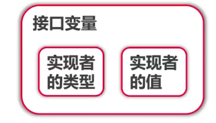
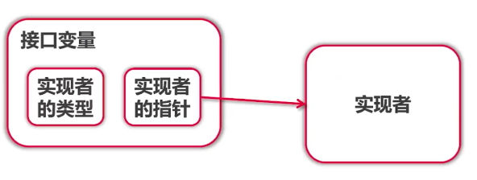
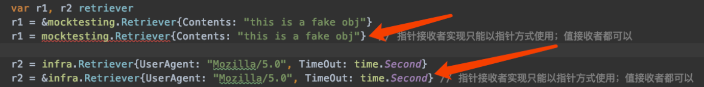

# 接口

## 一、duck typing
### 1. 大黄鸭是鸭子吗？

- 传统类型系统：脊索动物门，脊椎动物亚门，鸟纲雁形目… 不是
- duck typing：是鸭子
- 概念：“像鸭子走路，像鸭子叫（长得像鸭子），那么就是鸭子”
- 描述事物的外部行为而非内部结构，使用者只关心外部
- 严格说 go 属于结构化类型系统，类似 duck typing

### 2. Python 中的 duck typing
```python
def download(retriever):
    return retriever.get("www.baidu.com")   // 输入参数只有实现了get方法就可以了
```
- 运行时才知道传入的 retriever 有没有 get
- 需要注释来说明接口
### 3. C++中的 duck typing
```
template <class R>
string download(const R& retriever) {
    return retriever.get("www.baidu.com")
}
```
- 编译时才知道传入的 retriever 有没有 get
- 需要注释来说明接口

### 4. Java 中的类似代码 duck typing
```java
<R extends Retriever>
String download(R r) {
    return r.get("www.baidu.com")
}
```
- 传入的参数必须实现 Retriever 接口
- 不是 duck typing
- 同时需要 Readable, Appendable 怎么办？（apache polygene）

### 5. Go 语言的 duck typing
- 同时具有 Python, C++的 duck typing 的灵活性
- 又具有 Java 的类型检查

## 二、 为什么需要接口？
- 由于 Go 是强类型语言，所有的变量类型都是严格需要定义的，当函数输入为**某一类**具有特定的功能的结构体时，就会变得比较麻烦，
接口就是用来描述具有某一类特定的功能的类型， 用这个类型来定义入参

## 三、 Go 的接口

### 1. Go 接口定义
- 使用者（download）→实现者（retriever）
- 接口由使用者定义

```go
package main

import (
	"downloader/infra"
	"fmt"
)

// 定义接口
// ?: Something that can "Get"
type retriever interface {
	Get(string2 string) string
}

// 返回类型为接口类型
func getRetriever() retriever {
	//return mocktesting.Retriever{}
	return infra.Retriever{}
}

func main() {
	var r retriever = getRetriever()
	fmt.Println(r.Get("https://www.baidu.com"))
}
```

### 2. 接口变量里面有什么
- 有实现者的类型和实现者的值

    

- 有实现者的类型和实现者的指针

    

- 接口变量自带指针
- 接口变量同样采用值传递，几乎不需要使用接口的指针
- 指针接收者实现只能以指针方式使用；值接收者都可以

    

### 3. 查看接口变量
- Type Assertion
    ```go
    // 查看接口变了内部是什么？ 方法：type assertion
    func assertionInspect(r retriever) {
    	fmt.Printf("Input r: %T  %v |分割| ", r, r)
    	if mockR, ok := r.(*mocktesting.Retriever); ok {
    		fmt.Printf("mockR.Contents: %s |分割| ", mockR.Contents)
    	} else {
    		fmt.Printf("r is not a *mocktesting.Retriever  |分割| ")
    	}
    
    	if infraR, ok := r.(infra.Retriever); ok {
    		fmt.Printf("infraR.TimeOut: %d |分割| ", infraR.TimeOut)
    	} else {
    		fmt.Println("r is not a infra.Retriever")
    	}
    }
    ```

- Type Switch
    ```go
    // 查看接口变了内部是什么？ 方法：switch type
    func switchInspect(r retriever) {
        fmt.Printf("%T  %v |分割| ", r, r)
        switch v := r.(type) {
        case *mocktesting.Retriever:
            fmt.Println("Contents: ", v.Contents)
        case infra.Retriever:
            fmt.Println("UserAgent: ", v.UserAgent)
        }
    }
    ```
- 详见 chapter_06/01_interface_test 代码
### 4. Go 语言使用 interface{} 表示任何类型
- 表示任何类型: `interface{}`
- `interface{}` 的使用示例 详见 chapter_06/02_any_type 代码


## 四、Go 接口 的组合

- Go 系统库的接口组合代码
    ```go
    type Reader interface {
        Read(p []byte) (n int, err error)
    }
    
    type Writer interface {
        Write(p []byte) (n int, err error)
    }
    
    type Closer interface {
        Close() error
    }
    
    // ReadWriteCloser is the interface that groups the basic Read, Write and Close methods.
    type ReadWriteCloser interface {
        Reader
        Writer
        Closer
    }
    ```
## 五、常用系统特殊接口
- Stringer 实现该接口后，当调用 fmt.Print* 系列函数就会打印该函数返回字符串
```go
func (r *Retriever) String() string {  // Retriever 结构体实现 fmt.Stringer 接口
	return fmt.Sprintf("Retriever: {Contents=%s}", r.Contents)  // fmt.Println(r) 的时候会自动调用该方法
}

func main() {
	// 1. 测试接口代码
	r := &mocktesting.Retriever{Contents:"This is a fake web"}
	fmt.Println(r)   // Retriever: {Contents=This is a fake web}
}
```
- Reader/Writer 实现该接口便于文件，网络，等读写操作


