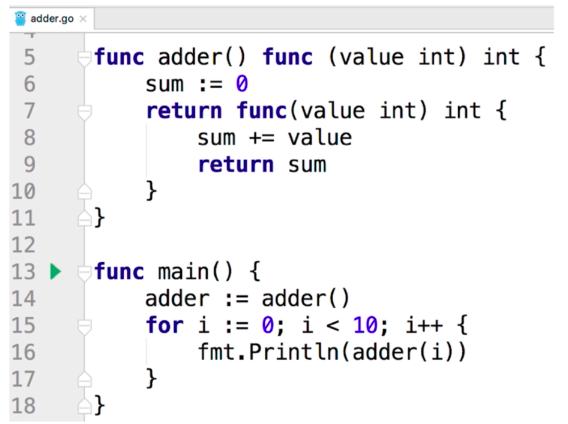
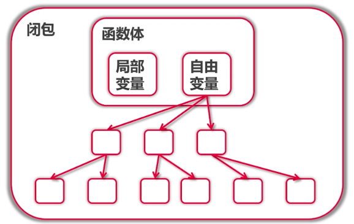
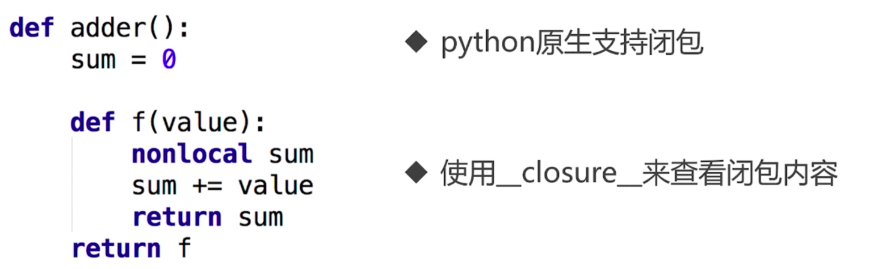
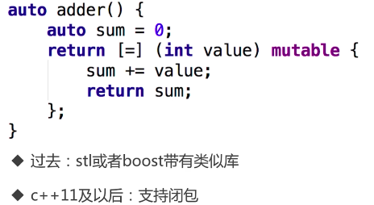
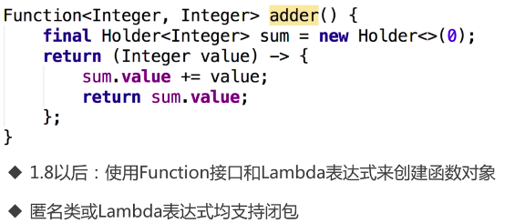

# 函数式编程
## 一、函数与闭包


### 1. 函数式编程 vs 函数指针
- 函数式一等公民：参数、变量、返回值都可以是函数
- 高阶函数：
    - 接受一个或多个函数作为输入, 输出一个函数 
    - 例如：回调函数 函数复合 apply函数 排序函数(接受一个比较函数作为参数) 等
- 函数 -> 闭包

### 2. "正统" 函数式编程
- 不可变性：不能有状态，只有常量和函数
- 函数只能有一个参数

### 3. 闭包


#### Go 语言闭包实现 adder
```go
package main

import "fmt"

// 方法一: 使用闭包实现 adder
func adder() func(int) int {
	sum := 0
	return func(i int) int {
		sum += i
		return sum
	}
}

// 方法二 "正统" 函数式编程 实现 adder
type iAdder func(int) (int, iAdder)

func adder2(base int) iAdder {
	return func(v int) (int, iAdder) {
		return base + v, adder2(base + v)
	}
}

func main() {
	fmt.Println("---- 使用闭包实现 adder --- ")
	a := adder()
	for i := 0; i < 10; i++ {
		fmt.Printf("0 + 1 + ... + %d = %d \n", i, a(i))
	}

	fmt.Println(`---- "正统" 函数式编程 实现 adder ----`)
	a2 := adder2(0)
	for i := 0; i < 10; i++ {
		var sum int
		sum, a2 = a2(i)
		fmt.Printf("0 + 1 + ... + %d = %d \n", i, sum)
	}
}

// 输出结果
/*
---- 使用闭包实现 adder ---
0 + 1 + ... + 0 = 0
0 + 1 + ... + 1 = 1
0 + 1 + ... + 2 = 3
0 + 1 + ... + 3 = 6
0 + 1 + ... + 4 = 10
0 + 1 + ... + 5 = 15
0 + 1 + ... + 6 = 21
0 + 1 + ... + 7 = 28
0 + 1 + ... + 8 = 36
0 + 1 + ... + 9 = 45
---- "正统" 函数式编程 实现 adder ----
0 + 1 + ... + 0 = 0
0 + 1 + ... + 1 = 1
0 + 1 + ... + 2 = 3
0 + 1 + ... + 3 = 6
0 + 1 + ... + 4 = 10
0 + 1 + ... + 5 = 15
0 + 1 + ... + 6 = 21
0 + 1 + ... + 7 = 28
0 + 1 + ... + 8 = 36
0 + 1 + ... + 9 = 45
*/
```

#### python 中的闭包实现
 

#### c++ 中的闭包

    
#### Java 中的闭包



## 二、 使用闭包实现斐波那契数列
```go
package main

import (
	"bufio"
	"fmt"
	"io"
	"strconv"
	"strings"
)

// 1 1 2 3 5 8 13 ...
func fibonacci() intGen {
	a, b := 0, 1
	return func() int {
		a, b = b, a+b
		return a
	}
}

// 定义斐波那契返回函数，用于实现 Reader 接口
type intGen func() int

// 为 intGen 实现 Reader 接口
func (g intGen) Read(p []byte) (n int, err error) {
	next := g()
	s := strconv.Itoa(next) + "\n"
	//s := fmt.Sprintf("%d\n", next)
	if next > 100 {
		return 0, io.EOF
	}
	return strings.NewReader(s).Read(p)
	//s := fmt.Sprint("%s")

}

// 读取实现 Reader 接口的对象
func printFileContents(reader io.Reader) {
	scanner := bufio.NewScanner(reader)
	for scanner.Scan() {
		fmt.Println(scanner.Text())
	}
}

func main() {

	f := fibonacci()
	//fmt.Println(f())
	//fmt.Println(f())
	//fmt.Println(f())
	//fmt.Println(f())
	//fmt.Println(f())
	//fmt.Println(f())
	//fmt.Println(f())

	fmt.Println("---------- 使用 printFileContents 打印 ------------")
	printFileContents(f)

}

// 输出结果
/*
---------- 使用 printFileContents 打印 ------------
1
1
2
3
5
8
13
21
34
55
89
*/

```

## 三、使用函数来遍历二叉树
- 详见实现代码

## 总结 Go 语言闭包的应用
- 更加自然，不需要修饰如访问自由变量
- 没有 lambda 表达式，但是有匿名函数
