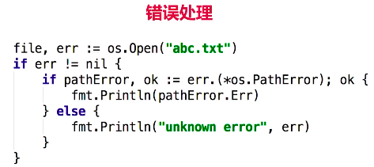

# 资源管理与出错处理
## 1. defer
### 1.1 defer 调用
- 确保调用在函数结束时发生
- 参数在 defer 语句时计算
- defer 列表为后进先出
### 1.2 何时使用 defer 调用
- Open/Close
- Lock/Unlock
- PrintHeader/PrintFooter

## 2. 错误处理一


### 2.1 自定义 error 详见以下代码

### 2.2 处理 特定类型的 error

```go
package main

import (
	"bufio"
	"errors"
	"fmt"
	"os"
)

// 定义一个斐波那契数列生成函数
func fibonacci() func() int {
	a, b := 0, 1
	return func() int {
		a, b = b, a+b
		return a
	}
}

// 使用 defer 写文件
func writerFile() {
	filename := "learnGo/chapter_08/02_error/abc.txt"
	file, err := os.OpenFile(filename, os.O_EXCL|os.O_CREATE, 0666)
	if err != nil {
		/* 通过实现该接口，也可以自定义error
		type error interface {
			Error() string
		}
		*/
		err = errors.New("this is a custom err!!!")  // 使用 errors.New 自定义 error
		if pathError, ok := err.(*os.PathError); !ok {  // 判断 err 是否是 PathError
			fmt.Println("Error: ", err.Error())        // Error:  this is a custom err!!!
			panic(err)
		}else {
			// 输出:    'Operation: open, Path: learnGo/chapter_08/02_error/abc.txt, Error: file exists'
			fmt.Printf("Operation: %s, Path: %s, Error: %s\n", pathError.Op, pathError.Path, pathError.Err)
			return
		}
	}
	defer file.Close()   // 创建好文件就 defer Close() 确保函数退出时关闭文件
	writer := bufio.NewWriter(file)  // 使用缓存写文件 先写到内存
	defer writer.Flush()             // 当函数退出时 将内存中的文件写到真实的文件中
	f := fibonacci()
	for i := 0; i < 20; i++ {
		fmt.Fprintln(writer, f())   // 将 fib 数列写入到 buffer file 中
	}
}

func main() {
	fmt.Println()
	writerFile()
}

```

## 3. 错误处理二 （http web 统一错误处理）
### 3.1 详见代码 chapter_08/03_error_handler

## 4. panic 和 recover 

### 4.1 panic
- panic 停止当前函数执行
- 一直向上返回，执行每一层的defer
- 如果没有遇到recover，程序退出
### 4.2 recover
- 仅在defer调用中使用
- 获取panic的值
- 如果无法处理，可重新panic
- 测试代码如下
    ```go
    package main
    
    import (
    	"fmt"
    )
    
    func tryRecover() {
    	defer func() {
    		r := recover()
    		if err, ok := r.(error); ok {
    			fmt.Printf("Error occured: %s\n", err.Error())
    		} else {
    			panic(fmt.Sprintf("I don't know what to do: %v", r))
    		}
    	}()
    
    	// 测试一 输出: Error occured: this is a error
    	//panic(errors.New("this is a error"))
    	
    	// 测试二 输出: Error occured: runtime error: integer divide by zero
    	/*a := 0
    	b := 1/a
    	fmt.Println(b)*/
    
    	/* 测试 三 输出:
    	panic: 123 [recovered]
    	        panic: I don't know what to do: 123
    	*/
    	panic(123)
    }
    
    func main() {
    	tryRecover()
    }
    ```

 ## 5. 错误处理综合示例
 
 ### 5.1 error vs panic
 - 意料之中的：使用error。如：文件打不开
 - 意料之外的：使用panic。如：数组越界
 
 ### 5.2 错误处理综合示例
 - defer + panic + recover
 - Type Assertion
 - 函数式编程的应用
 - 综合示例代码见 chapter_08/05_prefect_application