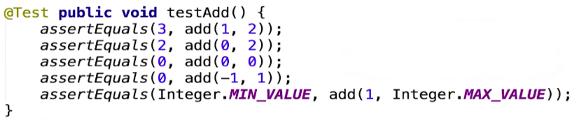
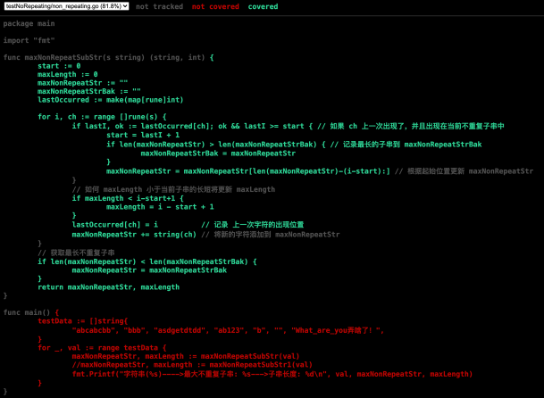
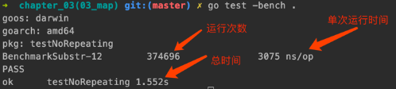
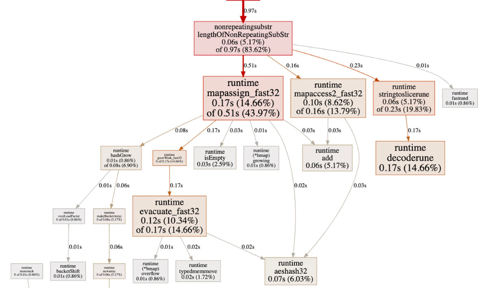
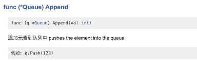
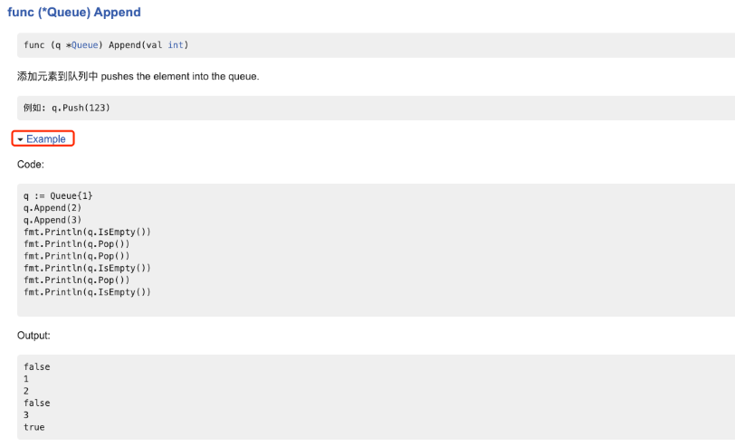

# 测试与性能调优
## 1 测试
### 1.1 Debugging Sucks! Testing Rocks!


### 1.2 传统测试 vs 表格驱动测试
#### 1.2.1 传统测试



- 测试数据和测试逻辑混在一起
- 出错信息不明确
- 一旦一个数据出错测试全部结束

#### 1.2.2 表格驱动测试
```
tests := []struct {
    a, b, c int32
}{
    {1, 2, 3},
    {0, 2, 2},
    {0, 0, 0},
    {-1, 1, 0},
    {math.MaxInt32, 1, math.MinInt32},
}

for _, tt := range tests {
    if actual := add(tt.a, tt.b); actual != tt.c {
        t.Errorf("add(%d, %d); got %d; expected %d", tt.a, tt.b, actual, tt.c)
    }
}
```

- 分离的测试数据和测试逻辑
- 明确的出错信息
- 可以部分失败
- go 语言的语法使得我们更易实践表格驱动测试

### 1.3 测试代码如何写
- 在需要测试 .go 文件同目录下，创建 xxx_test.go 文件
- 测试函数名要以 Test 开头, 如：`unc TestErrWrapper(t *testing.T) {}`
- 在命令行通过 `go test .` 执行测试文件
- 详细测试代码见 chapter_09/01_tryTest

## 2 查看代码测试覆盖率
```shell script
go test -coverprofile=c.out 
go tool cover -html=c.out
```
- 获取代码测试覆盖率 `go tool cover -html=c.out` 输出html如下

    

## 3. 测试代码性能
```shell script
go test -bench .
```
- 在测试文件 xxx_test.go 中 加入 Benchmark 开头的测试函数 
  如：`func BenchmarkSubstr(b *testing.B) {}`
- 运行命令： `go test -bench .`
- 详见代码 chapter_09/01_tryTest/chapter_03(03_map)
    ```go
    func BenchmarkSubstr(b *testing.B) {
    	s := "What_are_you弄啥了！What_are_you弄啥了！"
    	subStr := "are_you弄啥了！Wh"
    	subStrLen := 14
    	for i := 0; i< b.N; i++{
    		actualSubstr, actualLen := maxNonRepeatSubStr(s)
    		if actualSubstr != subStr || actualLen != subStrLen {
    			b.Errorf("maxNonRepeatSubStr: %s, got actual Substr: %s, got actual subStrLen: %d \n"+
    				"expected Substr: %s, expected subStrLen: %d", s, actualSubstr, actualLen, subStr, subStrLen)
    		}
    	}
    }
    ```
    
    

## 4 使用 pprof 进行性能调优

- pprof 命令
    ```shell script
    go test -bench . -cpuprofile cpu.out  生成运行性能文件
    go tool pprof cpu.out   使用 pprof 查看性能文件  
    # 进入 pprof 交互式命令行，最简单的为输入 web生成图形
     
    #  Failed to execute dot. Is Graphviz installed? Error: exec: "dot": executable file not found in $PATH
    brew install graphviz  // 安装 graphviz 包才可以看到图形页面
    ```
- 示例代码详见 chapter_09/02_optimized_operation_speed
    

## 5 http 测试
- 通过使用假的 Request/Response（TestErrWrapper）
- 通过起服务器（TestErrWrapperInServer）
- 测试代码详见 chapter_09/03_test_http_server

## 6 生成文档和示例代码
- go doc/godoc 命令
    ```shell script
    go doc <pkg>
    # 网页文档
    godoc -http :6060   // 文档看地址 http://127.0.0.1:6066/pkg/<module name>
    ```
- 用注释写文档, 注释中的缩进会有惊奇的效果
    ```go
    // 添加元素到队列中 pushes the element into the queue.
    // 		例如: q.Push(123)
    func (q *Queue) Append(val int) {
    	*q = append(*q, val)
    }
    ```
  
  
- 在测试中文件中加入 Example, 会很好的体现到文档中
    ```go
    func ExampleQueue_Append() {
    	q := Queue{1}
    	q.Append(2)
    	q.Append(3)
    	fmt.Println(q.IsEmpty())
    	fmt.Println(q.Pop())
    	fmt.Println(q.Pop())
    	fmt.Println(q.IsEmpty())
    	fmt.Println(q.Pop())
    	fmt.Println(q.IsEmpty())
    
    	// Output:
    	// false
    	// 1
    	// 2
    	// false
    	// 3
    	// true
    }
    ```
  
- 使用 go doc/godoc 来查看/生成文档
