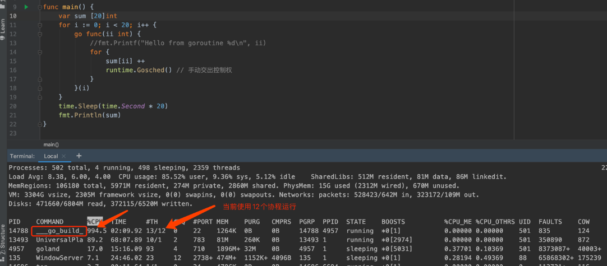
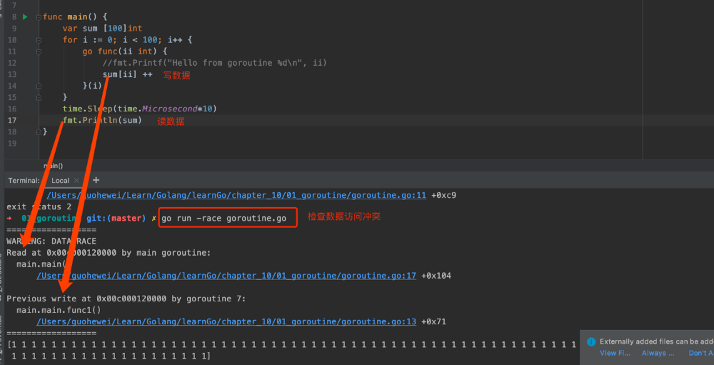

# Goroutine

## 1. 协程 Coroutine
- 协程像轻量级的 "线程"
- 非抢占式多任务处理，由协程主动交出控制权
- 协程是 编译器/解释器/虚拟机层面的多任务，Go 是编译器层面的多任务
- 多个协程可能在一个或者多个线程上运行

    

### 1.1 子进程是协程的一个特例
- Subroutines are special cases of more general program components, called coroutines.
- 普通函数：线程  main ➝ doWork
- 协程：线程（可能） main ⟺ doWork
  
### 1.2 其它语言中的协程
- C++：Boost.Corouting
- Java：不支持
- Python：使用 yield 关键字实现协程，Python 3.5加入了 async def 对协程原生支持

### 1.3 goroutine 的定义
- 任何函数只需加上 go 就能送给调试器运行
- 不需要在定义时区分是否是异步函数
- 调度器在合适的点进行切的
- 使用-race 来检测数据访问冲突：`go run -race  xxx.go`

    

### 1.4 go routine 可能的切换点
- I/0, guohewei
- channel
- 等待锁
- 函数调用（有时）
- runtime.Gosched()
- 只是参考，不能保证切换，不能保证在其他地方不切换

