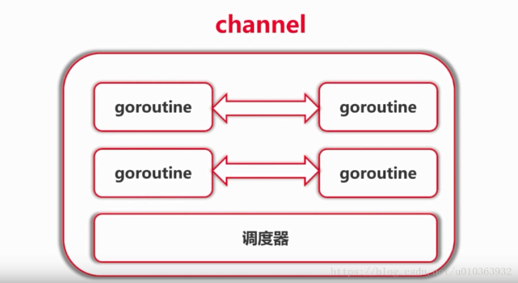

# Channel



## 1 Channel 的用法
- 使用 var 定义的 channel 是一个nil值，需要使用 make 定义
   ```
   var c chan int // c == nil
   ch := make(chan int)  
   ```
- buffered channel `c := make(chan int, 5)`
- 定义 channel 的方向 `var c chan<- int`
- 使用 range 接收 channel 中的数据
    ```
    for v := range ch{
        fmt.Printf("worker %d received %c\n", i, v)
    }
    ```
- 理论基础：Communication Sequential Process (CSP)
- Don't communicate by sharing memory; share memory by communicating.
- 不要通过共享内存来通信；通过通信来共享内存
- 使用示例代码见 chapter_11/01_channel_demo

## 2 使用Channel等待goroutine任务结束
### 2.1 通过自定义channel实现等待goroutine任务结束
- WaitGroup的使用
- 示例代码详见 chapter_11/02_channel_done/channelDone_1

### 2.2 通过 sync.WaitGroup实现等待goroutine任务结束
- 示例代码详见 chapter_11/02_channel_done/channelWaitGroup_2

## 3 使用Channel实现树的遍历
- 示例代码详见 chapter_11/03_traverse_with_channel

## 4 使用 Select 进行调度
- Select 的使用
- 定时器的使用
- 在Select中使用 nil Channel
- 示例代码详见 chapter_11/04_select_demo
## 5 传统同步机制
- WaitGroup
- Mutex
  - 示例代码详见 chapter_11/05_mutex_demo
- Cond