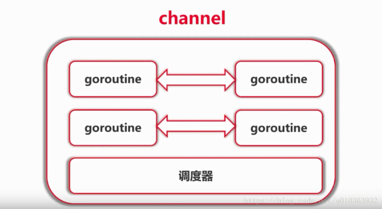

# Channel



## 1 Channel 的用法
- 使用 var 定义的 channel 是一个nil值，需要使用 make 定义
   ```
   var c chan int // c == nil
   ch := make(chan int)  
   ```
- buffered channel `c := make(chan int, 5)`
- 定义 channel 的方向 `var c chan<- int`
- 使用 range 接收 channel 中的数据
    ```
    for v := range ch{
        fmt.Printf("worker %d received %c\n", i, v)
    }
    ```
- 理论基础：Communication Sequential Process (CSP)
- Don't communicate by sharing memory; share memory by communicating.
- 不要通过共享内存来通信；通过通信来共享内存
- 使用示例代码见 chapter_11/01_channel_demo

## 2 使用Channel等待goroutine任务结束
### 2.1 通过自定义channel实现等待goroutine任务结束
- WaitGroup的使用
- 示例代码详见 chapter_11/02_channel_done/channelDone_1

### 2.2 通过 sync.WaitGroup实现等待goroutine任务结束
- 示例代码详见 chapter_11/02_channel_done/channelWaitGroup_2

## 3 使用Channel实现树的遍历
- 示例代码详见 chapter_11/03_traverse_with_channel

## 4 使用 Select 进行调度
- Select 的使用
- 定时器的使用
- 在Select中使用 nil Channel
- 示例代码详见 chapter_11/04_select_demo
## 5 传统同步机制
- WaitGroup
- Mutex
  - 示例代码详见 chapter_11/05_mutex_demo
- Cond

## 6 sync包的使用
- Mutex   互斥锁 
  1.  Lock()  
  2.  UnLock()
- RWMutex 读写互斥锁 
  1. Lock()      写的时候，排斥其他的写锁和读锁
  2. UnLock()    释放写锁
  3. Rlock()     在读取的时候 不会阻塞其他的读锁，但是会排斥写锁 Lock()
  4. RUnlock()   释放读锁
- Once    Once.Do(一个函数) 这个方法无论被调用多少次，只会执行一次
- WaitGroup  
    1. Add(delta int) 设定需要Done多少次
    2. Done() 没执行一次加1
    3. Wait() 阻塞到 执行Done() 的次数 和 Add(delta int)的delta次数相同
    示例代码详见 chapter_11/02_channel_done/channelWaitGroup_2
- Map 一个并发字典, 可并发读写
    1. Store(key, val)              写入字典中数据
    2. Load(key)                    读取字段中数据
    3. LoadOrStore(key, defaultVal) 读不到设置key默认值defaultVal
    4. Range(func(key, value interface{}) bool {})  
                                    传入一个函数，遍历字典（函数每返回true, 开始遍历下一个元素，返回false终止遍历）                     
    5. Delete(key)                  删除字典中key
- Pool 并发池  通过Put 将数据丢到Pool中，然后Get() 但是没有顺序，可以用完再丢回去
    1. Put
    2. Get
- Cond 通知锁
    1. NewCond(lock)    创建一个Cond
    2. cond.L.Lock() ~ cond.L.Unlock()  创建一个锁区间 在区域内部可以cond.Wait()
    3. cond.Wait()      在锁区间内部可以cond.Wait()
    4. cond.Broadcast() 全部释放cond.Wait()
    5. cond.Signal()    解锁一个cond.Wait()