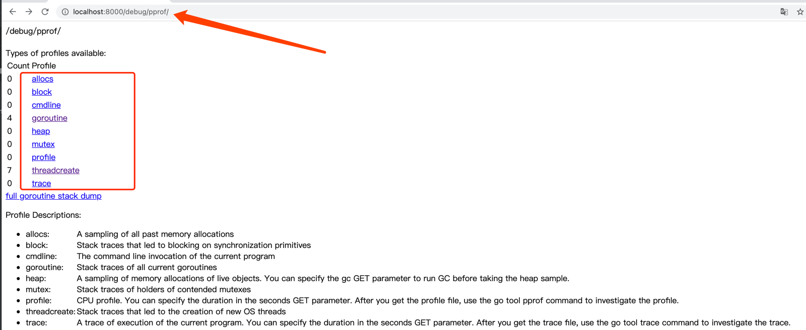

# http及其他标准库
## http
- 使用 http 客户端发送请求
- 使用 http.Client 控制请求头部等
- 使用 httputil 简化工作
- 示例代码详见: chapter_13/01_http_client

## http 服务器的性能分析

- import _ “net/http/pprof”
- 访问/debug/pprof
- 示例代码详见：chapter_09/03_test_http_server/web.go

  

- 使用 go tool pprof 分析性能
    ```
    # 内存使用情况
    go tool pprof http://localhost:8000/debug/pprof/heap
    # 30秒 CPU使用情况
    go tool pprof http://localhost:8000/debug/pprof/profile?seconds=30
    ```
## 其它标准库
- bufio (示例代码 chapter_08/02_error/defer.go)
- log
- encoding/json
- regexp
- time
- strings/math/rand

### 文档
- godoc -http :8888
- https://studygolang.com/pkgdoc

## 第三方 http 框架
- gin-gonic
- middleware的使用
- context的使用
- 示例代码详见（chapter_13/02_gindemo）
