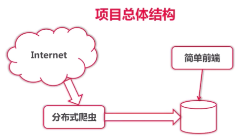
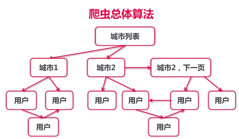

# 开始实战项目
## 1 爬虫项目介绍
### 1.1 为什么做爬虫项目
- 有一定的复杂性
- 可以灵活调整项目的复杂性
- 平衡语言/爬虫之间的比重

### 1.2 网络爬虫分类
- 通用爬虫，如 baidu, google
- 聚焦爬虫，从互联网获取结构化数据

### 1.3 go语言的爬虫库/框架

- henrylee2cn/pholcus
- gocrawl
- colly
- hu17889/go_spider

### 1.4 本课程爬虫项目
- 将不使用现成爬虫库/框架
- 使用 ElasticSearch 作为数据存储
- 使用 Go 语言标准模板库实现 http 数据展示部分

### 1.5 爬虫的主题
#### 1.5.1 爬取内容
- 内容：如新闻，博客，社区…
#### 1.5.2 爬取人
- QQ 空间，人人网，微博，微信，facebook？
- 相亲网站，求职网站
- 出于隐私和趣味性考虑，本课程将爬取相亲网站

### 1.6 项目结果和算法

