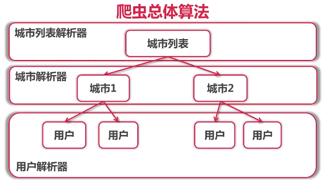

# 单任务版爬虫
## 1 获取网页内容
- 使用http.Get获取内容
- 使用Encoding来转换编码：gbk -> utf-8
- 使用charset.DetermineEncoding来判断编码

## 2 获取城市链接和名字
- 使用css选择器
- 使用xpath
- 使用正则表达式

## 3 总体算法

## 4 解析器 Parser
- 输入：utf-8编码的文本
- 输出：Request{URL, 对应Parser}列表，Item列表

## 5 单任务版爬虫架构

