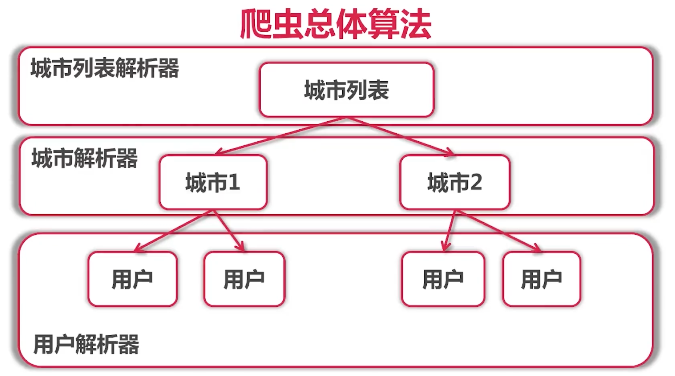
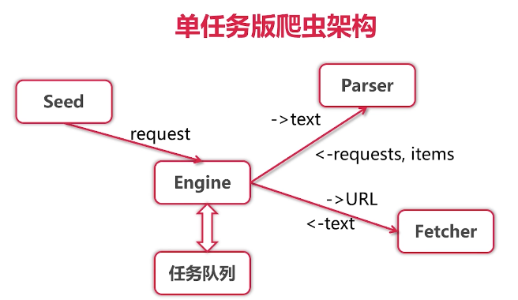
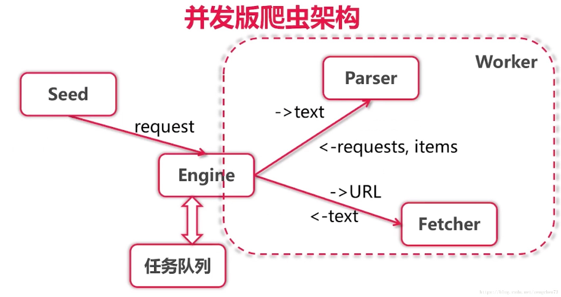
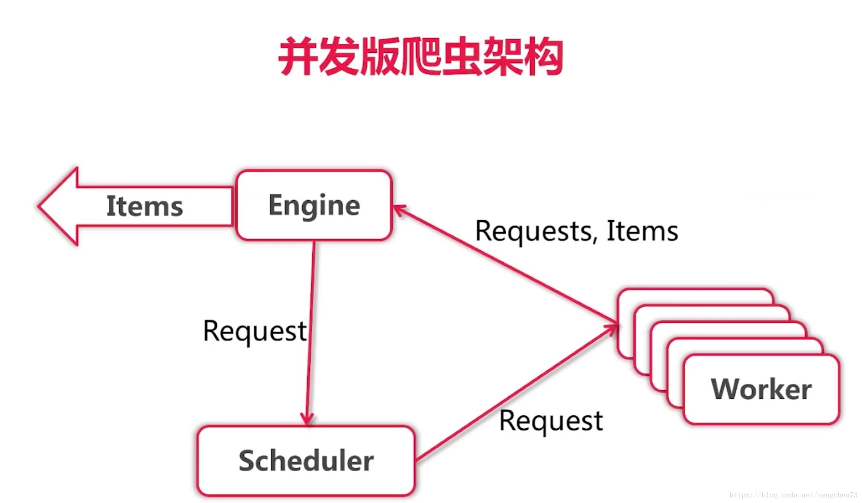
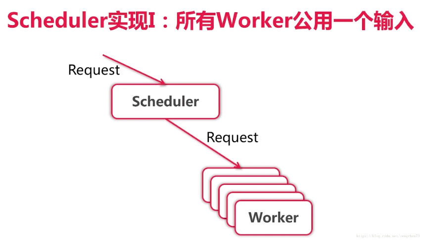
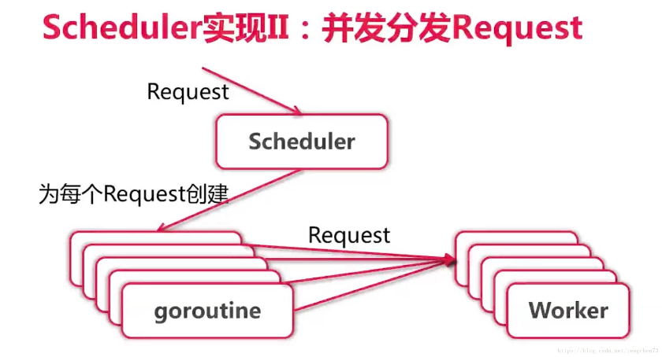
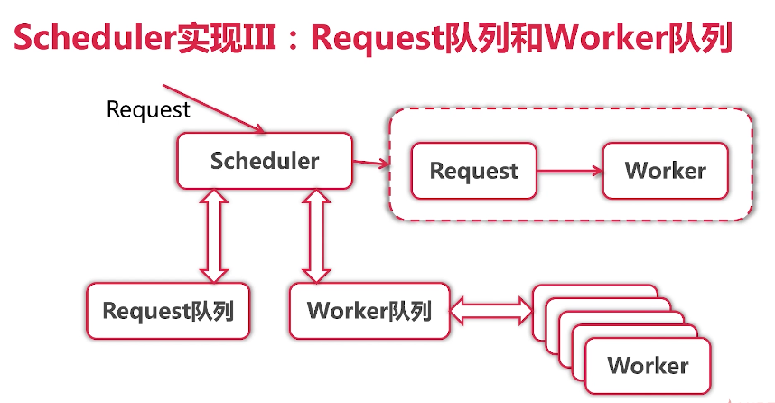

# 单任务版爬虫
## 1 获取网页内容
- 使用http.Get获取内容
- 使用Encoding来转换编码：gbk -> utf-8
- 使用charset.DetermineEncoding来判断编码

## 2 获取城市链接和名字
- 使用css选择器
- 使用xpath
- 使用正则表达式

## 3 总体算法


## 4 解析器 Parser
- 输入：utf-8编码的文本
- 输出：Request{URL, 对应Parser}列表，Item列表

## 5 单任务版爬虫架构


## 6 并发版爬虫架构
在单机版的基础上，将耗时最长，等待时间做多的进行并发 ，也就是Fetch模块
Fetch的输出就是Parse的输入，也就是可以把Fetch和Parse合成一个模块 －－ worker模块




worker输入是Request，输出是一个Request ＋ Items
加入一个Scheduler，也就是对任务的调度器，简单来讲的就是Engine原来把Request交给任务列表，现在交给Scheduler

按照这个并发结构：
- 并发worker，开启很多worker
- worker并发之后就会面临一个多对多的任务分配，需要一个scheduler去分配这些任务
- 并发版的箭头不像单机版，表示输入的参数和返回值，每个箭头都代表一个channel
- 方框表示一个goroutine， engine和scheduler都表示一个goroutine, worker是有很多个

### 6.1 简单版
并发版爬虫的关键在于实现scheduler，怎么把request进行分发
简单版：所有worker共用一个输入，也就是所有worker一起抢下一个request，谁抢到了谁做


1. 并发之后变快了，原因在于Fetch操作是在worker里进行的，而且是10个worker一起进行。
Fetch操作结束后，Parse会交给Engine新的Request，Engine将Request放在Scheduler中，Scheduler将等到有空闲的worker可以接受in通道的Request。虽然10个worker公用一个in通道，但是却可以同时处理很多request。不需要等一个request处理完了再处理下一个

2. 但是这种做法有一个问题，那就是Schedule必须等到有空闲的worker来接收Scheduler写入in通道的东西。但是有可能的问题是当从out中取出一个结果时，对应要往in通道写入多个。这就会导致in通道可能会一直等空闲的worker来读而卡在那里。如下，就会卡在那里
    ```go
    func gofunc(in chan int, out chan int ) {
        for i := 0 ;i< 100 ;i++ {
            go func() {
                for {
                    <- in
                    out <- 1
                }
            }()
        }
    }
     
    func main(){
        in := make(chan int)
        out := make(chan int)
     
        gofunc(in ,out)
     
        in <- 1
        for{
            <- out
            in <- 1
            in <- 1
        }
    }
    ```
3. 解决的办法就是：

    

    ```go
    func gofunc(in chan int, out chan int ) {
        for i := 0 ;i< 100 ;i++ {
            go func() {
                for {
                    <- in
                    if xxx {
                        out <- 1
                    }	
                }
            }()
        }
    }
     
    func main(){
        in := make(chan int)
        out := make(chan int)
     
        gofunc(in ,out)
     
        in <- 1
        for{
            <- out
            go func(){ in <- 1 }
            go func(){ in <- 1 }
        }
    } 
    ```


### 6.2 URL 去重
- 哈希表
- 计算MD5等哈希，再存哈希表
- 使用bloom filter 多重哈希结果
- 使用Redis等key-value存储系统实现分布式去重
