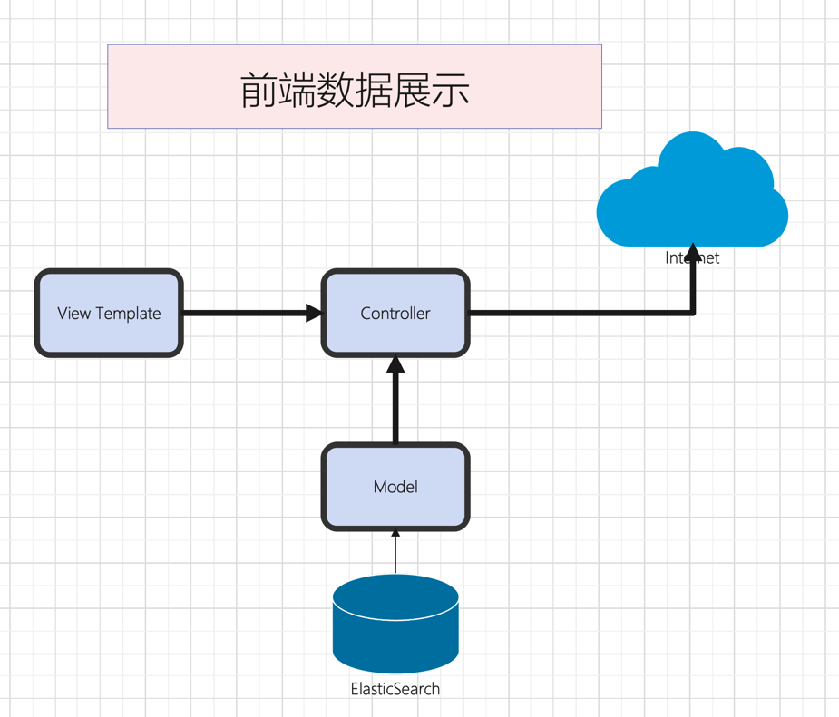

# ElasticSearch

## 本章

代码与capture16合并在一起，详见参考: chapter_16/crawler

## 作用

- 存储我们爬取的数据
- 不需要建表，配置字段等
- json 格式的文档
- 寻找：男，有房，有车
- 寻找：女，年轻漂亮 -> 身材好 -> 年前身材指标好
- 原生支持，不需要写代码，不需要拼装查询语句

## 安装

- 方法一：从网站下载安装包，安装，配置，运行
- 方法二：直接使用docker部署

### docker安装ElasticSearch

- 官网地址：https://www.elastic.co/guide/en/elasticsearch/reference/current/docker.html

### ElasticSearch 初识

- 使用REST接口
- `<server>`:9200/index/type/id
- index -> database
- type -> table
- type 中的数据类型可以不一致
- 可以使用_mapping来配置类型 `<index>`/`<type>`/_mapping
- 不需要预先创建index和type
- POST/PUT 创建/修改数据，使用POST可省略id
- GET获取数据
- GET `<index>`/`<type>`/_search?q=全文搜索

### html/template 展示数据

- 模板引擎
- 服务器端生成最终网页
- 适合做后台或者维护页面
- 功能
  - 取值
  - 选择
  - 循环
  - 函数调用

