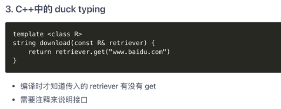

## 那些go语言没有的元素

### 1. 类，继承，多态，重载
- go语言拥有不同的世界观
- 在面向对象界，也流行变继承为组合的思维
- 这些面向对象的元素太容易被滥用
- go语言为组合提供了更便捷的支持

### 2. try/catch/finally
- 太多错误被当做异常
- 很多c++项目组本身禁用try/catch
- 正确的使用try/catch处理错误，导致代码混乱
- try/catch在产品代码中并不能减小开发人员的负担
- go也有defer/panic/recover 模式
### 3. 泛型
- 泛型作为模板类型
  
  
  
  - 这种泛型实际想实现duck typing
  - go语言提供了对 duck typing, 和接口组合的支持
- 泛型约束参数类型
  ```cgo
  // 伪代码
  List<Integer>.add("abc") // compile error
  List<Integer>.add("abc") // OK
  ```
  - 这种做法本身非常复杂：类型通配符，covariance等问题
  - go语言本身自带强类型的slice，map，channel
  - 使用type assertion 甚至 go generate 来实现自己的泛型
  - 泛型支持是go作者唯一态度不强硬的点
  
### 4. 构造函数/解析函数/RAII c++
- 大型项目中很少使用构造函数，多使用工厂函数
- 值类型的构造由结构体初始化语法实现
- RAII 技巧性太强，隐藏了意图
- 析构函数与垃圾回收不匹配
### 5. 操作符重载
### 6. assert
