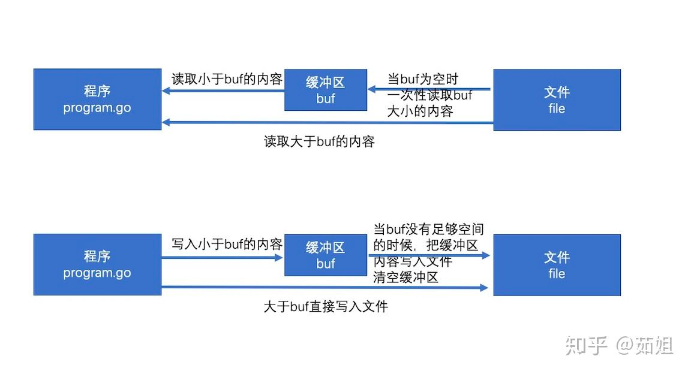

## goland 文件操作

### 1. os 包常量

```go
// Exactly one of O_RDONLY, O_WRONLY, or O_RDWR must be specified.
O_RDONLY int = syscall.O_RDONLY // open the file read-only.
O_WRONLY int = syscall.O_WRONLY // open the file write-only.
O_RDWR   int = syscall.O_RDWR   // open the file read-write.
// The remaining values may be or'ed in to control behavior.
O_APPEND int = syscall.O_APPEND // append data to the file when writing.
O_CREATE int = syscall.O_CREAT  // create a new file if none exists.
O_EXCL   int = syscall.O_EXCL   // used with O_CREATE, file must not exist.     和 O_CREATE 配合使用，文件必须不存在
O_SYNC   int = syscall.O_SYNC   // open for synchronous I/O.                    打开文件用于同步IO
O_TRUNC  int = syscall.O_TRUNC  // truncate regular writable file when opened.  如果可能打开时清空文件

```


### 2. 读取文件方法

- os.openFile() 用户打开文件
  ```go
  func Create(name string) (*File, error) {
      return OpenFile(name, O_RDWR|O_CREATE|O_TRUNC, 0666)
  }
  ```
- bufio.NewReader(f)  将文件转化为Reader
  ```go
  // NewReader returns a new Reader whose buffer has the default size.
  func NewReader(rd io.Reader) *Reader {
  return NewReaderSize(rd, defaultBufSize)
  }
  ```
- reader.ReadString("string") 调用reader上的方法 还有 ReadLine ReadByte ReadSlice
- ioutil.ReadAll(f) 直接读取整个文件 os.ReadFile(文件路径) 也能达到同样效果
- os.ReadDir("./) 读取文件夹，获取目标文件夹下的文件信息

### 3. 写文件的方法
- os.OpenFile() 用于打开文件获取 *file
- f.Seek()  移动光标位置
- f.WriteString() 直接写入
- bufio.NewWrite(f) 创建一个缓存的写
  - writer.WriteString() 写入内存
  - write.Flush() 缓存内容生效，写入文件

#### 3.1 bufio 包


bufio 封装了io.Reader或io.Writer接口对象，并创建另一个也实现了该接口的对象。

io.Reader或io.Writer 接口实现read() 和 write() 方法，对于实现这个接口的对象都是可以使用这两个方法的。

##### 3.1.1 Reader对象

bufio.Reader 是bufio中对io.Reader 的封装

```go
// Reader implements buffering for an io.Reader object.
type Reader struct {
    buf          []byte
    rd           io.Reader // reader provided by the client
    r, w         int       // buf read and write positions
    err          error
    lastByte     int // last byte read for UnreadByte; -1 means invalid
    lastRuneSize int // size of last rune read for UnreadRune; -1 means invalid
}
```
**bufio.Read(p []byte) 相当于读取大小len(p)的内容，思路如下：**
1. 当缓存区有内容的时，将缓存区内容全部填入p并清空缓存区
2. 当缓存区没有内容的时候且len(p)>len(buf),即要读取的内容比缓存区还要大，直接去文件读取即可
3. 当缓存区没有内容的时候且len(p)<len(buf),即要读取的内容比缓存区小，缓存区从文件读取内容充满缓存区，并将p填满（此时缓存区有剩余内容）
4. 以后再次读取时缓存区有内容，将缓存区内容全部填入p并清空缓存区（此时和情况1一样）

##### 3.1.2 Writer对象

bufio.Writer 是bufio中对io.Writer 的封装

```go
// Writer implements buffering for an io.Writer object.
// If an error occurs writing to a Writer, no more data will be
// accepted and all subsequent writes, and Flush, will return the error.
// After all data has been written, the client should call the
// Flush method to guarantee all data has been forwarded to
// the underlying io.Writer.
type Writer struct {
  err error
  buf []byte
  n   int
  wr  io.Writer
}
```

**bufio.Write(p []byte) 的思路如下**

1. 判断buf中可用容量是否可以放下 p
2. 如果能放下，直接把p拼接到buf后面，即把内容放到缓冲区
3. 如果缓冲区的可用容量不足以放下，且此时缓冲区是空的，直接把p写入文件即可
4. 如果缓冲区的可用容量不足以放下，且此时缓冲区有内容，则用p把缓冲区填满，把缓冲区所有内容写入文件，并清空缓冲区
5. 判断p的剩余内容大小能否放到缓冲区，如果能放下（此时和步骤1情况一样）则把内容放到缓冲区
6. 如果p的剩余内容依旧大于缓冲区，（注意此时缓冲区是空的，情况和步骤3一样）则把p的剩余内容直接写入文件


### 4. 复制文件