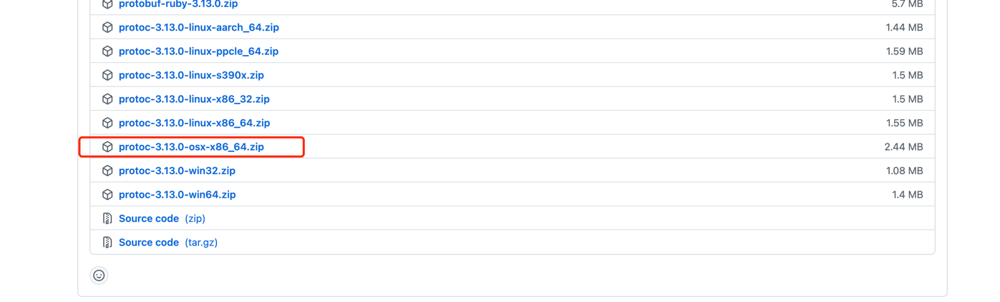
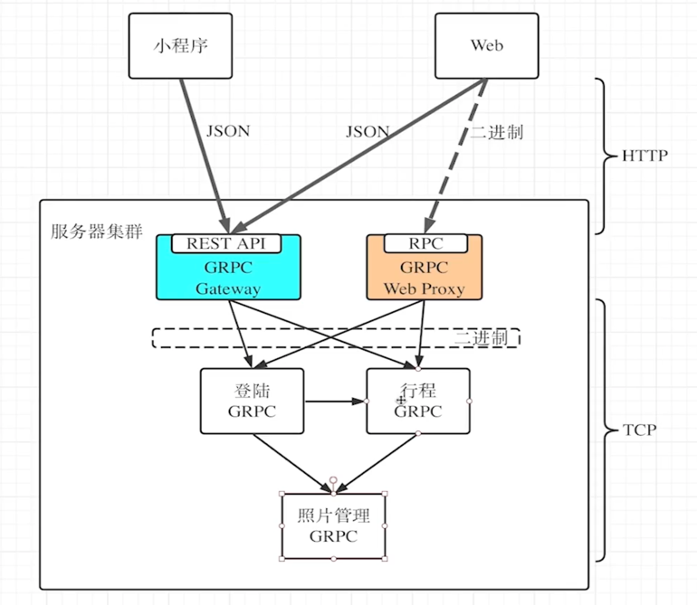
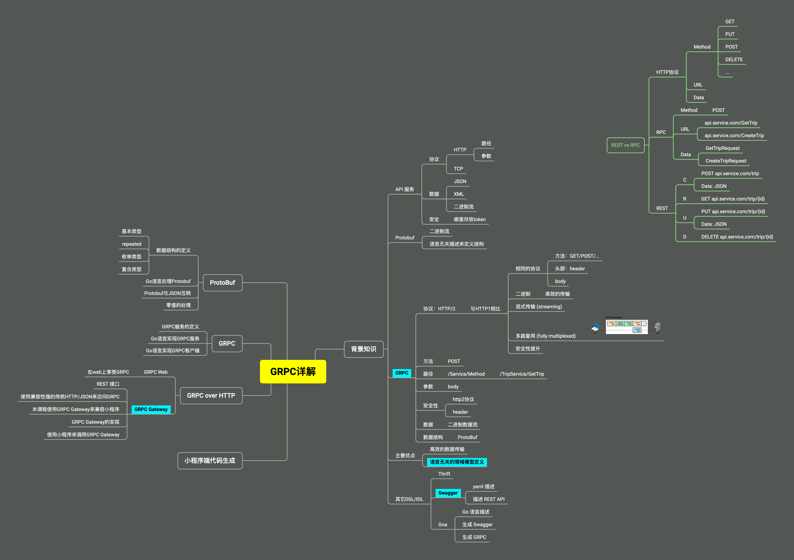

# GPRC 学习

## 1. 安装GRPC

- 中文文档：
    - https://grpc.io/docs/languages/go/quickstart/
    - https://doc.oschina.net/grpc?t=58011

### 1.1 安装 GRPC (V1)

1. 安装protoc 3.13
    - 下载链接：https://github.com/protocolbuffers/protobuf/releases/tag/v3.13.0
      
    - 下载完成解压后，设置PATH (`~/.bashrc` `~/.zshrc`  `~/.bash_profile`)
      

2. 为protoc安装go语言插件

```shell
go install github.com/grpc-ecosystem/grpc-gateway/protoc-gen-grpc-gateway@latest
go install github.com/grpc-ecosystem/grpc-gateway/protoc-gen-swagger@latest
go install github.com/golang/protobuf/protoc-gen-go@latest
```

### 1.2 安装最新的 (V2)

1. github地址：https://github.com/grpc-ecosystem/grpc-gateway/tree/master

```shell
go install github.com/grpc-ecosystem/grpc-gateway/v2/protoc-gen-grpc-gateway@latest
go install github.com/grpc-ecosystem/grpc-gateway/v2/protoc-gen-openapiv2@latest
go install google.golang.org/protobuf/cmd/protoc-gen-go@latest
go install google.golang.org/grpc/cmd/protoc-gen-go-grpc@latest
```

## 2. 学习

1. protobuf 文件(trip.proto)
2. 学习文档地址：https://www.yuque.com/docs/share/24345ade-4c2f-4d54-9bfb-e09553aa5703

```protobuf
syntax = "proto3";
package test;
option go_package = "01_code/proto/gen/go;trippb";    // 生成 package 路径和包名


// 1. protobuf 中所有字段都是可选的 多串，少传 都不会报错
// 2. 所有字段都是可选的 不填默认就是 零值，所以字段填 零值 和 不填 是等价的
// 3. 新增字段时，要明确零值是表示什么意思，以便于新老系统正确运行

message Location {
  double latitude  = 1;
  double longitude = 2;
}

// 枚举类型
enum TripStatus {
  TS_NOT_SPECIFIED = 0;    // 不传，默认是 0
  NOT_STARTED      = 1;
  IN_PROGRESS      = 2;
  FINISHED         = 3;
  PAID             = 4;
}

message Trip {
  string            start           = 6;
  string            end             = 2;
  int64             duration_sec    = 3;
  Location          end_pos         = 1;         // 复合类型
  int64             fee_cent        = 4;
  repeated Location path_locations  = 7;         // 数组类型 repeated 类型
  Location          start_pos       = 5;
  TripStatus        status          = 8;         // 枚举类型
  bool              isPromotionTrip = 9;         // 是否参与优惠，老系统不会传 默认false， 新系统传 true (yes)
  bool              isFromGuestUser = 10;        // 是否为访客，老系统不会传 默认false， 新系统依据实际情况传
}
```

2. 生成go包命令  `protoc -I=. --go_out=paths=source_relative:gen/go trip.proto`

```shell
├── 01_code
│   ├── hello.go
│   └── proto
│       ├── gen
│       │   └── go
│       │       └── trip.pb.go
│       └── trip.proto
└── README.md
```

4. Go 语言处理Protobuf `hello.go`

```go
package main

import (
	"encoding/json"
	"fmt"
	"github.com/golang/protobuf/proto"
	trippb "trip/proto/gen/go"
)

func main() {
	trip := trippb.Trip{
		Start:       "shanghai",
		End:         "beijing",
		DurationSec: 1500,
		FeeCent:     1200,
		StartPos: &trippb.Location{
			Latitude:  30,
			Longitude: 120,
		},
		EndPos: &trippb.Location{
			Latitude:  31,
			Longitude: 121,
		},
		PathLocations: []*trippb.Location{
			{
				Latitude:  31,
				Longitude: 121.1,
			},
			{
				Latitude:  31,
				Longitude: 121.1,
			},
		},
		Status: trippb.TripStatus_PAID,
	}

	// proto Marshal Unmarshal 示例
	fmt.Println(&trip)
	b, err := proto.Marshal(&trip)
	if err != nil {
		panic(err)
	}

	fmt.Printf("%X\n", b)

	var trip2 trippb.Trip
	err = proto.Unmarshal(b, &trip2)
	if err != nil {
		panic(err)
	}
	fmt.Printf("%v", &trip2)
	fmt.Println("")

	// json Marshal Unmarshal 示例
	res, _ := json.Marshal(&trip2)
	fmt.Printf("%s\n", res)

	var trip3 trippb.Trip
	err = json.Unmarshal(res, &trip3)

	if err != nil {
		panic(err)
	}
	fmt.Printf("%s\n", &trip3)

}
```

5. proto 文件可以通过 import 导入其他的 proto 文件
6. 嵌套 message
7. map 类型
8. timestamp 类型

## 3. GRPC 微服务

1. GRPC服务的定义
2. Go语言实现GRPC服务
3. Go语言实现GRPC客户端

- 简单模式（类似普通接口请求，返回数据）
- 服务端流模式 （服务端返回流数据）
- 客户端流模式 （客户端返回流数据）
- 双向流模式 （服务端和客户端同时双向发送流）
- 示例代码详见 （LearnGRPC/01_code）

4. metadata 相当于http中header
5. grpc 拦截器
    1. 客户端拦截器
    2. 服务端拦截器
    3. 第三方开源中间件，基于拦截器：https://github.com/grpc-ecosystem/go-grpc-middleware
6. 通过 metadata 和 grpc 拦截器 实现 auth 认证
7. 通过 客户端拦截器 grpc.WithPerRPCCredentials 和服务端 metadata + 拦截器 实现 auth 认证
    ```go
    opts = append(opts, grpc.WithPerRPCCredentials(grpcCredential{}))
    ```
8. GRPC 验证器: https://github.com/envoyproxy/protoc-gen-validate
9. GRPC 状态码: https://github.com/grpc/grpc/blob/master/doc/statuscodes.md
   ```go
    // 服务端
    type ErrorService struct{}
    
    func (e ErrorService) ErrorUsage(ctx context.Context, empty *empty.Empty) (*errortestpb.RespData, error) {
    //return nil, status.Error(codes.Unauthenticated, "鉴权失败")
    return nil, status.New(codes.Unauthenticated, "鉴权失败").Err()
    }
    ```

   ```go
    // 客户端
    errorClient := errortestpb.NewErrorTestClient(conn)
    errorResp, err := errorClient.ErrorUsage(context.Background(), &emptypb.Empty{})
    if err != nil {
        if st, ok := status.FromError(err); ok {
            log.Printf("Error code: %s, Error message: %s\n", st.Code(), st.Message())
            return
        }
        log.Printf("Call ErrorUsage return unkown error: %v\n", err)
   }
   ```
10. GRPC 超时机制 通过 context 设置超时机制
   ```go
   // ErrorUsageTimeOut grpc 设置超时返回error示例 client 代码
   func ErrorUsageTimeOut(conn *grpc.ClientConn) {
       errorClient := errortestpb.NewErrorTestClient(conn)
       ctx, _ := context.WithTimeout(context.Background(), time.Second*3)
       errorResp, err := errorClient.ErrorUsage(ctx, &emptypb.Empty{})
       if err != nil {
           if st, ok := status.FromError(err); ok {
               log.Printf("Error code: %s, Error message: %s\n", st.Code(), st.Message())
               return
           }
           log.Printf("Call ErrorUsage return unkown error: %v\n", err)
       }
       log.Println("Resp.TraceId: ", errorResp.TraceId)
   }
   ```
总结：
1. 

## 4. GRPC-GateWay



学习脑图：
